# China GFW and Iran Internet Filtering — Packet-Level Technical Reference

> **PVNetwork permanent research reference**  
> Research/access date: **2026-08-18**  
> Repository baseline re-checked before write: `main` at `a2a02fa537d9be42969a8a2f0b2f637c390fb71a` (the branch was moving concurrently; GitHub applied this file to the then-current `main`).  
> Scope: architecture, measurement, packet/flow analysis, censorship diagnosis, and protocol-detection evidence.  
> Safety boundary: this document intentionally does **not** provide endpoint-hiding recipes, active-probe evasion instructions, packet-mutation recipes, working IP/domain lists, or exploitation guidance.

---

## 0. Executive answer

A packet sent from an Iranian or Chinese user to a foreign server can be observed at several classes of infrastructure: the user's access network, ISP aggregation/core, domestic transit/backbone, international-facing transit/gateway links, and any censorship or monitoring system attached to those paths. The exact physical topology is not public and is not necessarily one inline appliance. Measurements in both countries show a mixture of inline/drop behavior and systems that can observe traffic and inject forged packets or trigger separate actions. **The safe model is a distributed policy/enforcement system, not a single box called “the firewall.”** [C03][C04][C05][I01][I03][I09]

Without decrypting TLS application data, an on-path observer can normally see Layer-3/4 metadata (source/destination IP, transport protocol, ports, packet lengths, timing, direction, TCP flags) and, with ordinary non-ECH TLS, the plaintext `ClientHello` including SNI, supported versions, cipher suites, extensions, ALPN, supported groups, signature algorithms, GREASE-related behavior, extension ordering, and ClientHello/record size. TLS 1.3 encrypts most later handshake material and application data, but it does **not** make traffic metadata invisible. QUIC Initial packets are protected but their Initial secrets are derived from public packet information; RFC 9001 explicitly states that these Initial keys are trivial for an observer to determine. The GFW has been independently measured decrypting QUIC Initial packets at scale and filtering by SNI. [S07][S09][S11][C05]

For proxy protocols, the most important diagnostic distinction is **protocol identity versus outer transport versus endpoint identity**. A failed “VLESS” connection does not, by itself, prove VLESS recognition. The failure may instead be destination-IP/prefix blocking, SNI blocking, DNS poisoning, TLS fingerprinting, port/UDP policy, QUIC disruption, routing/peering, MTU/PMTUD, server firewall, loss, overload, or a shutdown/whitelist regime. The evidence base differs sharply by protocol and country:

- **China / Shadowsocks:** `CONFIRMED PROTOCOL DETECTION` — passive first-packet analysis plus staged active probing was measured at IMC 2020. [C01]
- **China / VMess:** `STRONGLY SUPPORTED TRAFFIC-CLASS DETECTION` — USENIX Security 2023 explicitly found the GFW's fully-encrypted-traffic detector affects VMess. This does **not** prove a unique VMess semantic parser. [C02]
- **China / VLESS, Trojan, REALITY:** `NO PUBLIC INDEPENDENT EVIDENCE` of protocol-specific national-GFW identification in the sources reviewed. Their observable outer TLS/HTTP/QUIC/flow signals remain classifiable.
- **Iran / generic protocol classification:** `CONFIRMED` historically — FOCI 2020 measured a protocol whitelister that recognized a small set of allowed protocols, layered with ordinary censorship. [I02]
- **Iran / VMess, VLESS, Trojan, REALITY:** `NOT INDEPENDENTLY CONFIRMED` as protocol-specific classifiers in the public evidence reviewed through 2026-08-18. Iran has strong evidence for DNS/HTTP/SNI/TLS/UDP/QUIC interference and heterogeneous per-network policy, but those facts do not establish a dedicated parser for these four proxy protocols. [I03][I05][I06][I12]

The operational conclusion for PVNetwork is therefore evidence-driven diagnosis: **first prove where the failure begins, then prove which packet feature correlates with it. Do not label a protocol “filtered” from a single failed client session.**

---

# 1. Evidence and confidence rules

Every country-specific statement in this reference should be interpreted through these labels:

| Label | Meaning in this file |
|---|---|
| `CONFIRMED` | Direct, reproducible measurement or authoritative protocol/source evidence supports the specific claim. |
| `STRONGLY SUPPORTED` | Multiple independent measurements or a strong experiment support the claim, but scope/implementation details remain incomplete. |
| `OBSERVED` | A measurement/report observed the behavior in a defined network/time window; it must not be generalized beyond that scope. |
| `INFERRED` | Best explanation from measured effects; implementation was not directly observed. |
| `ANECDOTAL` | User/community report without a controlled independent measurement. |
| `UNKNOWN` | Evidence is insufficient to decide. |
| `NOT INDEPENDENTLY CONFIRMED` | A plausible or reported deployment claim was not verified by independent public measurement. |

**Evidence discipline:** a DPI vendor's capability is not proof that China or Iran deploys that capability. A protocol's source code showing a fingerprintable feature is not proof a national censor uses that feature. A paper demonstrating a classifier in a lab is not proof of deployment. A server IP being blocked is not proof its application protocol was recognized.

---

# 2. Network observation model: from access network to foreign server

## 2.1 Generic packet path

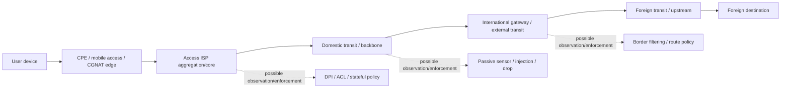

This diagram is a **conceptual observation model**, not a claim that every connection traverses one fixed censorship device. Measurements show different mechanisms and regional/provider variation. [C04][C06][I05][I09]

## 2.2 What an on-path observer can see

| Layer / object | Normally visible without TLS application-data decryption? | Notes |
|---|---:|---|
| Source/destination IPv4/IPv6 | Yes | NAT can replace the client source address at the public edge. |
| IP protocol, packet length, DSCP/ECN | Yes | Fragmentation and extension headers can change parsing complexity. |
| TCP/UDP source/destination ports | Yes | Port is a feature, not proof of application identity. |
| TCP flags, seq/ack patterns, MSS/window/options | Yes | Useful for state tracking and flow fingerprinting. |
| Packet direction, timing, inter-arrival, bursts | Yes | Remain visible even with strong payload encryption. |
| DNS over plain UDP/TCP | Yes | Query name/type and response are plaintext unless another protective layer is used. |
| TLS ClientHello in ordinary TLS | Yes | Includes SNI unless ECH succeeds; also versions/ciphers/extensions/ALPN/etc. |
| TLS 1.3 application data | No | Normally encrypted and integrity protected. |
| HTTPS path/query/body/credentials/page content | No | Normally inside TLS application data. |
| QUIC Initial ClientHello | Recoverable by an on-path observer | RFC 9001 Initial keys derive from public connection information; later QUIC levels have stronger confidentiality. [S11] |
| ECH `ClientHelloInner` | No, if ECH succeeds | `ClientHelloOuter`, IP/port/timing/size and ECH use remain observable. [S18] |

---

# 3. Great Firewall of China

## 3.1 Architecture

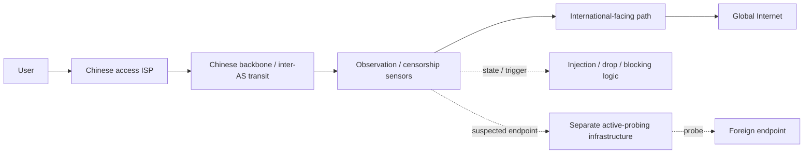

### Findings

- `CONFIRMED` — GFW DNS censorship can forge/inject responses for targeted names; longitudinal measurements show large-scale DNS manipulation rather than dependence on the user's chosen recursive resolver. [C03]
- `CONFIRMED` — HTTP and HTTPS domain filtering exists at scale. GFWeb measured HTTP Host and TLS SNI-triggered behavior and found bidirectional/loss-tolerant characteristics with asymmetries. [C04]
- `CONFIRMED` — some GFW systems can inject forged TCP reset traffic rather than merely drop packets. [C04]
- `CONFIRMED` — passive classification plus separate active-probing infrastructure has been measured for Shadowsocks. [C01]
- `CONFIRMED` — fully-encrypted TCP traffic has been passively classified since early November 2021 using efficient statistical/content-class heuristics. [C02]
- `CONFIRMED` — QUIC SNI censorship began in the measured system on 2024-04-07; the censor decrypts QUIC Initial packets at scale to inspect the contained TLS ClientHello. [C05]
- `CONFIRMED` — China is not accurately modeled as only a single national policy layer. IEEE S&P 2025 measured an additional regional censorship layer in Henan; the study tested multiple provinces/municipalities and specifically demonstrated the added Henan system. [C06]
- `OBSERVED` — injection-capable infrastructure separate from but co-located with the GFW was characterized by Citizen Lab as the “Great Cannon” in 2015. It should not be treated as synonymous with all GFW filtering. [C09]
- `INFERRED` — public measurements are consistent with observation points near major cross-border/transit paths for many national mechanisms, but the exact current physical appliance placement and vendor inventory are not publicly mapped comprehensively.

### National versus provincial/regional filtering

`CONFIRMED` — the **National GFW** and at least one **regional/provincial layer** can impose different policies. This matters for measurement: a test from one Chinese province cannot safely represent all of China. [C06]

---

# 4. Iran Internet Filtering Architecture

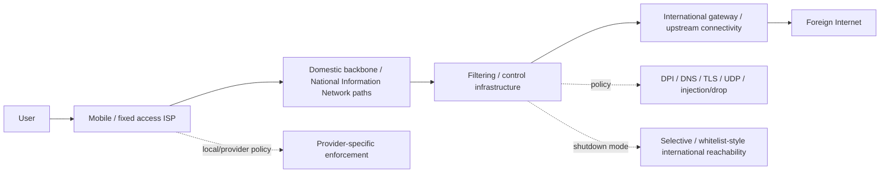

Again, this is a conceptual evidence-backed model rather than a claim of a single box.

## 4.1 Documented/measured properties

- `OBSERVED` — 2013 measurements from a major Iranian ISP found HTTP Host blocking, keyword filtering, DNS hijacking, protocol-based throttling, and topology evidence consistent with heavily centralized censorship equipment. This is **historical evidence**, not a claim that the 2013 exact implementation remains unchanged in 2026. [I01]
- `CONFIRMED` — in 2020, researchers measured a protocol whitelister permitting a small set of recognizable protocols (DNS, HTTP, HTTPS) and filtering other traffic, layered with Iran's other DPI censorship. [I02]
- `CONFIRMED` — USENIX Security 2025 IRBlock found large-scale DNS poisoning, HTTP blockpage injection and UDP-based disruption across substantial parts of Iranian address space, with overblocking/collateral effects. [I03]
- `OBSERVED` — OONI found DoT blocking in 2020 differed across MCI, TCI, Irancell and Shatel; most failures occurred around TLS handshakes, and some were SNI-dependent while others were endpoint-dependent. [I05]
- `OBSERVED` — 2019 shutdown data showed distinct mechanisms and timing by ASN. ITC AS12880 retained BGP visibility while active-probing/IBR data-plane signals fell close to zero, proving that a route can remain announced while forwarding effectively fails. [I09]
- `OBSERVED` — June 2025 measurements published at FOCI 2026 found censorship changes before/after the shutdown across DNS, HTTP, TLS and QUIC; QUIC censorship appeared before and persisted after the shutdown, while DNS-over-TCP censorship was temporary around the event. [I12]
- `OBSERVED` — January 8, 2026 Cloudflare telemetry showed a 98.5% drop in announced IPv6 address space before traffic collapsed to near zero. [I13]
- `STRONGLY SUPPORTED` — the February 28, 2026 shutdown was not primarily a mass IPv4 BGP-withdrawal event: Cloudflare observed traffic below 1% with no significant shift in announced IPv4 space. That supports forwarding/filter/allowlist explanations rather than “the routes disappeared.” [I14]
- `OBSERVED` — restoration from the February shutdown began May 26, 2026 and remained partial/uneven; Cloudflare's July 28 Q2 review described HTTP volume later settling around 59% of pre-shutdown levels after initially recovering further. [I16][I17]

## 4.2 National Information Network (NIN)

The NIN is important because **domestic reachability and international reachability are different failure domains**. During several shutdowns, domestic services remained more reachable while global connectivity was heavily restricted; however, January 2026 initially also disrupted substantial domestic functionality according to Filterwatch. [I09][I15]

`UNKNOWN` — the precise current internal control-plane architecture, policy distribution protocol, vendor/device inventory, and exact mapping between every ISP and centralized filtering site are not independently public in sufficient detail to make a complete physical diagram.

---

# 5. DNS censorship

## 5.1 Packet race / forged response model

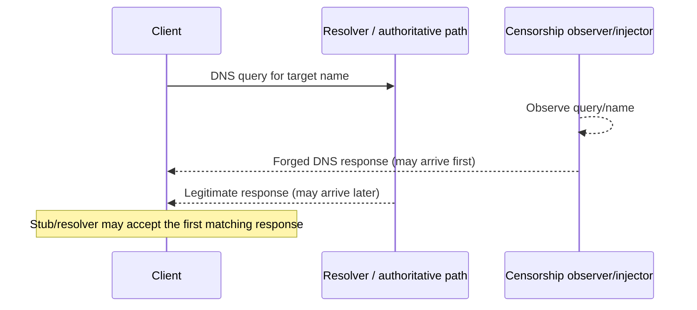

### China

- `CONFIRMED` — large-scale forged DNS responses and poisoning/injection. GFWatch's nine-month campaign measured hundreds of millions of domains daily and identified 311K censored domains in its observation period. [C03]
- `CONFIRMED` — bogus IPv4 and IPv6 answers have been observed. [C03]
- `STRONGLY SUPPORTED` — because forged responses can be injected on the path, changing only the recursive resolver does not necessarily eliminate censorship of plaintext DNS.

### Iran

- `CONFIRMED` — DNS poisoning/hijacking/injection has been measured historically and at large scale in recent work. [I01][I03][I11]
- `OBSERVED` — the censor's DNS behavior is not always a simple “wrong IP” rule; FOCI 2025 documented surprising correct-static-IP injections and DNS/HTTP correlations, leaving parts of the mechanism unexplained. [I11]
- `OBSERVED` — DoT reachability was non-uniform across ISPs in OONI's 2020 experiment. [I05]

### DNS transports

| Transport | Visibility / censorship surface |
|---|---|
| UDP/53 | Query/response plaintext; easy to intercept/inject/drop. |
| TCP/53 | Query/response plaintext but stateful TCP; Iran 2025 shutdown research observed temporary TCP-DNS censorship. [I12] |
| DoT | DNS encrypted after TLS; endpoint IP/port, TLS metadata and ordinary SNI remain visible. [S15] |
| DoH | DNS payload carried in HTTPS; destination IP and TLS/HTTP transport metadata remain. [S14] |
| ECH bootstrap | ECH config is commonly advertised through SVCB/HTTPS DNS records; availability/integrity of the DNS path remains an important dependency. [S16][S17][S18] |

---

# 6. IP, prefix, ASN and routing filtering

**IP blocked** and **service blocked** are different claims.

Possible Layer-3/forwarding mechanisms include exact destination-IP ACLs, prefix/subnet blocks, route suppression, null routes/blackholes, BGP withdrawal, provider route policy, and selective forwarding. A shared CDN IP makes IP-level filtering capable of collateral damage.

### Evidence

- **China:** `CONFIRMED` IP/endpoint blocking exists in the broader GFW literature, and active-probing discoveries can result in endpoint blocking for some proxy systems. [C01][C02]
- **Iran:** `CONFIRMED` address-space and destination/UDP disruption exists, but the exact enforcement method can differ by network and event. [I03][I04][I09]
- **ASN-wide blocking:** `POSSIBLE` as a policy mechanism, but **do not infer ASN blocking from several failed IPs in one ASN**. Demonstrate prefix breadth and controls first.
- **BGP-level filtering:** `CONFIRMED` as one shutdown mechanism in some Iran ASes/events; **not sufficient** to explain shutdowns where routes remain announced. [I09][I14]

---

# 7. HTTP filtering

Plain HTTP exposes the request line, `Host`, path/URI and headers to an on-path parser. Keyword filtering can therefore operate on request/response payload without cryptographic break.

- China: `CONFIRMED` HTTP Host-based filtering and injected resets/blocking have been measured at scale. [C04]
- Iran: `CONFIRMED` HTTP Host/keyword mechanisms were measured in 2013; IRBlock 2025 measured HTTP blockpage injection at large scale. [I01][I03]
- Historical HTTP behavior must not be automatically projected onto 2026 HTTPS-heavy traffic.

---

# 8. HTTPS / TLS filtering at packet level

## 8.1 TCP + TLS flow

1. `SYN` client → server: censor sees IPs, ports, TCP options.
2. `SYN/ACK` server → client: censor can confirm endpoint response and RTT characteristics.
3. `ACK` client → server.
4. TLS `ClientHello`: in ordinary TLS, visible before application-data encryption.
5. `ServerHello` and subsequent TLS handshake: TLS 1.3 encrypts most subsequent handshake messages after ServerHello.
6. Application data: HTTPS request path/body/content encrypted.

## 8.2 ClientHello fields useful for classification

| Feature | Observable in ordinary TLS | Security/DPI use technically possible | China censorship evidence | Iran censorship evidence |
|---|---:|---:|---|---|
| TLS supported versions | Yes | Yes | General TLS parsing confirmed; unique version-only classifier not established | TLS-handshake interference observed [I05] |
| SNI | Yes | Yes | `CONFIRMED` HTTPS SNI filtering [C04] | `OBSERVED/CONFIRMED` SNI-sensitive blocking [I05][I06] |
| Cipher suites | Yes | Yes | Observable; dedicated national policy rule `UNKNOWN` | Observable; dedicated rule `UNKNOWN` |
| Extension set/order | Yes | Yes | Observable; can contribute to fingerprint; censor-specific use beyond measured systems `UNKNOWN` | `NOT INDEPENDENTLY CONFIRMED` as a dedicated classifier |
| ALPN | Usually yes | Yes | Observable; dedicated policy `UNKNOWN` | Observable; dedicated policy `UNKNOWN` |
| Supported groups | Yes | Yes | Observable | Observable |
| Signature algorithms | Yes | Yes | Observable | Observable |
| GREASE behavior | Yes | Yes | Observable/fingerprintable | Observable/fingerprintable |
| ClientHello size / record boundaries | Yes | Yes | Flow/size analysis plausible; GFW uses packet-level heuristics for fully-encrypted traffic [C02] | Technically observable; deployment for specific proxies unproven |
| JA3/JA4-style composite | Derivable from visible metadata | Common security-analytics technique | Specific JA3/JA4 national-GFW rule `NOT INDEPENDENTLY CONFIRMED` | Specific JA3/JA4 state-censor rule `NOT INDEPENDENTLY CONFIRMED` |

### TLS 1.2 versus TLS 1.3

TLS 1.3 improves confidentiality of the handshake after ServerHello and modernizes cryptography, but the ordinary ClientHello remains visible unless ECH is successfully used. TLS 1.2 exposes even more handshake metadata historically. [S08][S09]

**Key rule:** `TLS encryption != metadata invisibility`.

---

# 9. TLS fingerprinting: JA3, JA3S, JA4 and implementation fingerprints

A fingerprint is a classifier built from observable handshake properties. It can identify a client implementation family or configuration with varying reliability; it is **not cryptographic proof of an application**.

Three concepts must remain separate:

1. **Technically observable:** cipher suites, extension IDs/order, ALPN, groups, signature algorithms, GREASE, ClientHello length, record boundaries.
2. **Commonly used by security/DPI products:** composite TLS fingerprints, behavioral fingerprints, client/server handshake signatures.
3. **Independently demonstrated as censor deployment:** only state this when measurement supports it.

`UNKNOWN / NOT INDEPENDENTLY CONFIRMED` — this research did not find public evidence proving that Iran's national censorship system or the GFW universally applies a specific JA3 or JA4 hash rule to classify VLESS/Trojan/REALITY. The same underlying fields are nevertheless visible and can be used by more general classifiers.

---

# 10. QUIC / HTTP/3

## 10.1 Why “QUIC Initial is encrypted” does not mean “SNI is secret”

QUIC Initial packets use AEAD, but RFC 9001 derives Initial secrets from the client's Destination Connection ID and a version-specific public salt. The RFC explicitly notes that Initial keys are trivial for an observer to determine; therefore an on-path censor can recover CRYPTO frames containing the TLS ClientHello. [S11]

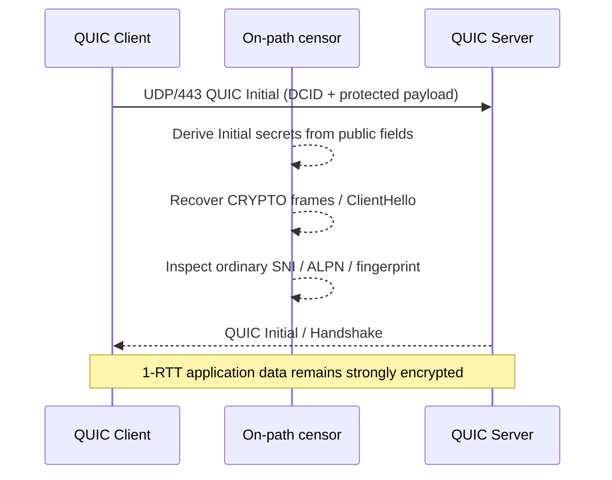

### China

`CONFIRMED` — the GFW began the measured QUIC SNI censorship mechanism on **2024-04-07**. USENIX Security 2025 found it decrypts Initial packets at scale, parses ClientHello/SNI, uses heuristics and a distinct blocklist. [C05]

### Iran

`OBSERVED` — FOCI 2026 measurements around the June 2025 shutdown found QUIC censorship enabled before the shutdown and persisting afterward, plus post-shutdown UDP instability. [I12]

`UNKNOWN` — the public Iran evidence reviewed does not establish that Iran implements the **same exact QUIC-Initial SNI classifier** as China. “QUIC blocked” can also arise from UDP/443 policy, generic UDP disruption, path loss, or server-side QUIC disablement.

---

# 11. Encrypted Client Hello

ECH is standardized in RFC 9849 (March 2026), with configuration bootstrapping through SVCB/HTTPS records described by RFC 9848 and RFC 9460. [S16][S17][S18]

### What ECH hides

- `ClientHelloInner`, including the sensitive SNI and potentially sensitive ALPN list, is encrypted to the ECH-capable client-facing server.
- The network does not learn the private SNI merely by reading the ordinary outer ClientHello.

### What ECH does not hide

- source/destination IP and transport protocol;
- destination port;
- packet sizes, timing, direction and connection frequency;
- the public `ClientHelloOuter` and the fact/shape of an ECH offer;
- the identity/anonymity-set context implied by the public destination/provider;
- DNS bootstrap availability unless protected by an appropriate DNS mechanism.

### Outer and inner ClientHello

`ClientHelloOuter` carries public/innocuous values and the `encrypted_client_hello` extension; `ClientHelloInner` carries the private values. [S18]

### Censorship conclusion

- `CONFIRMED` — ECH **theoretically and by standard design** hides the inner SNI when successfully negotiated. [S18]
- `NOT EQUIVALENT` — this does not prove ECH bypasses China or Iran.
- `OBSERVED HISTORICALLY` — China blocked the earlier ESNI mechanism in 2020. ESNI and current ECH are not identical protocols. [C08]
- `UNKNOWN` — this reference does not have 2026 evidence proving universal ECH success or universal ECH blocking across China or Iran.

---

# 12. Deep Packet Inspection (DPI)

DPI means parsing/analysis beyond basic destination routing fields. It can include reassembly, application parsing, TLS/QUIC handshake parsing and statistical classification. **DPI does not imply TLS decryption.**

## Observable without TLS application-data decryption

- IPs, prefixes, ASN mapping;
- TCP/UDP ports and protocol;
- packet size and direction;
- inter-arrival time, bursts, flow duration;
- TCP flags/options/retransmission patterns;
- plaintext DNS and HTTP;
- ordinary TLS ClientHello, SNI, ALPN and fingerprint fields;
- QUIC Initial metadata and, for an on-path observer, recoverable Initial ClientHello;
- ECH outer metadata;
- endpoint behavior after malformed/random/replayed connections.

## Normally encrypted

- HTTPS request path and query;
- cookies/authorization headers;
- request/response body;
- page/message/file content;
- proxy commands/authentication carried inside a successfully established TLS/QUIC application channel.

---

# 13. Traffic analysis and fully-encrypted traffic detection

Encryption removes straightforward payload semantics but not all statistical structure.

Possible features include packet-size distribution, flow duration, up/down ratio, bursts, reconnect rate, inter-arrival time, long-lived connections, multiplexing, handshake-to-data timing, first-payload size, direction and whether initial payload bytes resemble known plaintext protocols.

### China — what was actually measured

`CONFIRMED` — USENIX Security 2023 reverse-engineered a GFW fully-encrypted TCP classifier. Instead of identifying every encrypted proxy semantically, it used inexpensive heuristics to exempt traffic that looked like known protocols and block remaining suspicious traffic. Measured features included:

- common protocol fingerprints/exemptions;
- fraction of set bits;
- number/fraction/position of printable ASCII characters;
- characteristics of early payload data.

The system affected Shadowsocks, **VMess**, Obfs4 and other fully-encrypted protocols. [C02]

### Entropy / first packet

`CONFIRMED` — IMC 2020 found Shadowsocks suspicion triggered from **length and entropy of the first data packet**, followed by active confirmation probes. [C01]

### Iran

`CONFIRMED` — Iran has deployed protocol fingerprinting/whitelisting in measured periods. [I02]

`NOT INDEPENDENTLY CONFIRMED` — this research did not find an Iran measurement reproducing the GFW's exact set-bit/printable-byte fully-encrypted classifier or proving an equivalent VMess-specific entropy detector.

---

# 14. Machine learning

### Academic possibility

`CONFIRMED` as a general field — encrypted traffic can be classified probabilistically with ML/statistical models using flow metadata.

### Commercial DPI capability

`CONFIRMED` in the generic market sense — commercial network-security products can perform application/flow classification. This says nothing about a specific country's deployment.

### Independently observed censor deployment

- China: `CONFIRMED` statistical/heuristic classifiers exist, but the cited GFW fully-encrypted system was characterized as efficient heuristics; this file does **not** relabel it as ML without evidence. [C02]
- Iran: `NOT INDEPENDENTLY CONFIRMED` — no source reviewed here proves a specific national ML model is currently classifying VMess/VLESS/Trojan/REALITY.

---

# 15. Passive Detection

Evidence-backed conceptual pipeline:

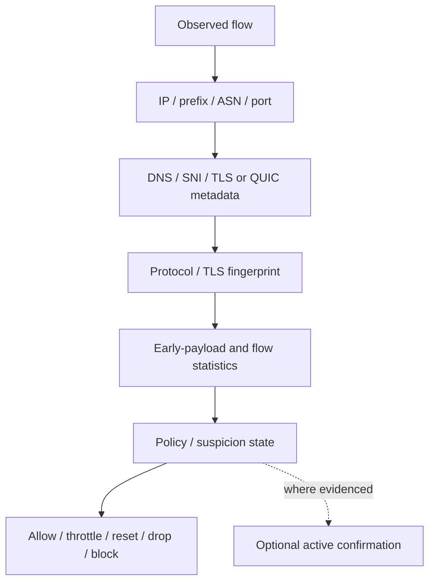

| Stage | China evidence | Iran evidence | Confidence |
|---|---|---|---|
| IP/prefix/port observation | Yes | Yes | `CONFIRMED` |
| DNS/HTTP/SNI parsing | Yes [C03][C04] | Yes [I01][I03][I05] | `CONFIRMED` |
| QUIC Initial/SNI parsing | Yes [C05] | QUIC censorship measured, exact parser not fully established [I12] | CN `CONFIRMED`; IR `OBSERVED` |
| Fully-encrypted early-payload classification | Yes [C02] | Exact equivalent not shown | CN `CONFIRMED`; IR `UNKNOWN` |
| Generic protocol whitelisting | Not the same architecture as Iran paper | Yes [I02] | IR `CONFIRMED` historically |
| Optional active probe | Yes for Shadowsocks and earlier Tor-style systems [C01] | Proxy-specific current deployment not established | CN `CONFIRMED`; IR `UNKNOWN` |

---

# 16. Active Probing

Active probing is **not** passive DPI. A passive system first observes a suspicious client-to-server flow; separate infrastructure then initiates its own connection to the suspected endpoint.

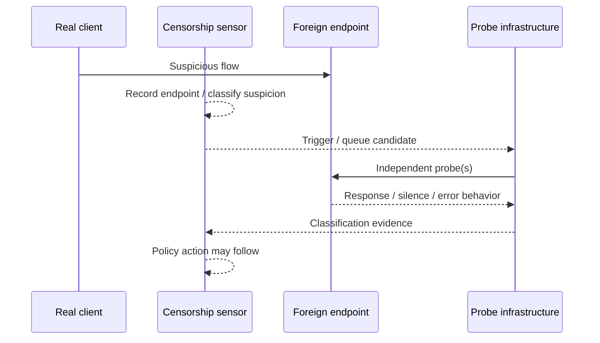

### China

`CONFIRMED` — Shadowsocks: passive suspicion followed by seven probe types/stages in IMC 2020. [C01]

`CONFIRMED` — the earlier GFW Report version observed both replay-derived and unrelated/random-style probes. [C11]

### Replay / modified / malformed / random probing

- Shadowsocks replay probing: `CONFIRMED` for China. [C01][C11]
- Random/malformed/protocol-aware staged probing: `CONFIRMED` for the Shadowsocks study in the sense that multiple distinct probe classes were measured; this reference intentionally omits evasion-oriented byte recipes. [C01]
- VMess-specific active confirmation in China: `UNKNOWN` from the reviewed public sources; passive VMess impact is directly documented. [C02]
- VLESS/Trojan/REALITY-specific active probing in China: `NO PUBLIC EVIDENCE` found here.
- Iran VMess/VLESS/Trojan/REALITY active probing: `NOT INDEPENDENTLY CONFIRMED` in the sources reviewed.

### Server-side fingerprinting

A server can potentially reveal identity through response/no-response, timeout, TLS behavior or reactions to invalid input. **Technically possible does not establish deployment.** Shadowsocks is the strong China example where active behavior was directly measured. [C01]

---

# 17. TCP filtering modes

| Failure mode | PCAP appearance | Censorship interpretation |
|---|---|---|
| SYN drop | repeated SYN, no SYN/ACK | Could be ACL/blackhole/firewall/path failure; not proof alone. |
| SYN/ACK drop | server sees SYN/responds; client never sees SYN/ACK | Requires dual-vantage capture to distinguish. |
| RST injection | reset appears inconsistent with endpoint/path behavior | Strong when TTL/sequence/two-sided captures support injection. China HTTP and Iran 2019 examples exist. [C04][I09] |
| Reset after ClientHello | TCP handshake succeeds; failure correlates with SNI/CH | Candidate TLS/SNI filtering; control SNI/IP required. |
| Silent packet drop | retransmissions/timeouts | Could be censorship or loss/routing/firewall. |
| Blackhole/null route | broad reachability failure to prefix | Verify BGP/control-plane and multiple ports/destinations. |
| Forwarding-plane shutdown | BGP stays visible while data-plane dies | Demonstrated in Iran 2019 and consistent with 2026 events. [I09][I14] |

---

# 18. UDP filtering and throttling

UDP has no TCP handshake, so absence of response is especially ambiguous.

- Plain DNS UDP/53 can be injected/redirected/dropped.
- UDP/443 carries most QUIC/HTTP/3.
- Generic high-port UDP failure can reflect firewall, NAT mapping, CGNAT timeout, loss or explicit policy.
- Iran: IRBlock measured broad UDP disruption; FOCI 2026 observed UDP instability around the 2025 shutdown. [I03][I12]
- China: dedicated QUIC SNI censorship is confirmed; it must not be conflated with blanket UDP blocking. [C05]

## 18.1 Congestion versus intentional throttling

A slow connection is not evidence of throttling. A credible experiment controls:

- same destination, same ISP, different protocol;
- same protocol, control destination;
- same target through different ISPs/ASNs;
- TCP versus UDP where service supports both;
- repeated times of day;
- throughput, RTT, loss, retransmission, reorder and connection setup time;
- server CPU/NIC and provider-side utilization.

`CONFIRMED HISTORICAL` — protocol-based throttling was measured in Iran in 2013. [I01]  
`UNKNOWN` — a current user's low throughput should not be attributed to deliberate throttling without contemporary controlled evidence.

---

# 19. Internet Shutdown Mechanisms

## 19.1 Control plane versus forwarding/data plane

**Control plane (BGP):** tells other autonomous systems that prefixes are reachable through a route.  
**Data plane:** actually forwards packets according to installed forwarding state/policy.

These can diverge.

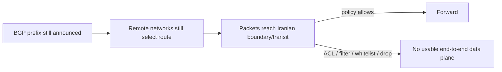

### Iran 2019 proof

`CONFIRMED` — IODA observed **ITC AS12880 with no BGP-signal drop** on Nov 16, 2019 while Active Probing and IBR fell nearly to zero. Therefore “prefix is still in BGP” is not evidence that users can pass traffic. [I09]

### Iran 2026

- January 8: IPv6 advertised address space dropped 98.5% before near-zero traffic. [I13]
- February 28: traffic fell below 1% without a significant IPv4 announcement shift; Cloudflare concluded route withdrawal was not the cause of that second shutdown. [I14]

### Mechanism comparison

| Mechanism | Control-plane change required? | Data-plane effect |
|---|---:|---|
| BGP withdrawal | Yes | Remote networks lose route / select alternative if any. |
| Route suppression at internal edge | Maybe | Selected paths disappear or fail. |
| Null route / blackhole | No external BGP change required | Packets discarded. |
| ACL/firewall drop | No | Selected traffic or all international traffic discarded. |
| DNS shutdown | No | Name resolution fails but IP reachability may remain. |
| Protocol block | No | Selected L4/application classes fail. |
| Whitelist mode | No | Default deny with selective allow. |
| Physical/gateway shutdown | Often but not necessarily reflected immediately in all BGP views | Broad reachability loss. |

---

# 20. Blacklist versus Whitelist

**Blacklist:** default allow, deny known targets/classes.  
**Whitelist:** default deny, allow selected targets/classes/users/services.

Potential policy keys include IP, prefix, ASN, hostname, protocol, destination class, organization and subscriber/access class. These are **possible policy dimensions**, not a claim Iran uses all of them.

`STRONGLY SUPPORTED` — Iran's 2026 shutdown/recovery displayed whitelist-style behavior: near-zero traffic while much IPv4 space remained announced, limited traffic persisted, and independent monitoring reported selective restoration. [I14][I15][I17]

`UNKNOWN` — the exact production matching keys and authorization database are not publicly established.

---

# 21. NAT / CGNAT / conntrack

- **NAT:** rewrites addresses/ports between routing domains.
- **CGNAT:** provider-scale NAT that multiplexes many subscribers behind public addresses.
- **conntrack/state table:** tracks flow state so return packets can be associated with a translation/policy decision.

CGNAT is **not censorship**. It complicates measurement because:

- many users share one public source IP;
- UDP state can expire quickly;
- inbound unsolicited probes may be impossible;
- port reuse can confuse endpoint-level attribution;
- NAT/firewall behavior can resemble UDP or idle-flow censorship.

Measurements should record access type, public IP, observed NAT behavior and whether a controlled server sees the same five-tuple the client expects.

---

# 22. IPv6

### China

`CONFIRMED` — GFW DNS censorship has produced bogus IPv6 answers; IPv6 is therefore not a generic censorship escape path. [C03]

`UNKNOWN` — exact parity of every IPv4 and IPv6 policy across every province/ISP/protocol in 2026 is not established.

### Iran

`OBSERVED` — January 8, 2026 saw a 98.5% fall in announced IPv6 space ahead of traffic collapse. [I13]

`OBSERVED` — current Cloudflare Radar snapshots in 2026 show extremely low IPv6 share compared with IPv4, but this is service-observation data and should not be interpreted as a complete national deployment census. [G04]

Dual-stack diagnostics must test A and AAAA separately, record Happy Eyeballs winner, and compare IPv4 TCP/UDP with IPv6 TCP/UDP.

---

# 23. Detection of V2Ray / Xray Proxy Protocols

This chapter asks a narrow question: **can China or Iran recognize Xray/V2Ray traffic, and what signal would that claim require?**

## 23.1 Canonical source pins

- `XTLS/Xray-core` **v26.3.27**, tag commit `d2758a023cd7f4174a5a5fa4ff66e487d4342ba0`; relevant modules include `proxy/vless/encoding/encoding.go`, `proxy/vmess/aead/authid.go`, `transport/internet/reality/reality.go`, `transport/internet/splithttp/`. [X01][X03][X04][X05][X06]
- `v2fly/v2ray-core` **v5.52.0**, tag commit `9db9c4bb0cd92d18064f8c430cca641b5c49ea43`. [X02]
- Trojan-Go reference repository `p4gefau1t/trojan-go`, latest release observed in the repository was **v0.10.6 (2021-09-14)**; its age is explicitly noted. [X07]

Source code establishes **wire behavior**, not censor deployment.

---

# 24. VMess and VMess AEAD

## 24.1 Source/wire behavior

Xray's VMess AEAD `AuthID` implementation constructs a 16-byte authentication identifier incorporating time/random/check material and encrypts it with an AES block derived from the command key; server-side matching includes freshness and anti-replay checks. [X04]

Consequences:

- VMess AEAD's early application bytes do not expose an obvious plaintext hostname or HTTP-style header.
- Pseudorandom-looking early payload can nevertheless be a **class feature** for a fully-encrypted-traffic classifier.
- Anti-replay in the server implementation affects what naive replay probes receive, but does not make passive flow statistics invisible.

Legacy VMess and AEAD should not be treated as identical wire formats.

## 24.2 China verdict

`STRONGLY SUPPORTED TRAFFIC-CLASS DETECTION` — USENIX Security 2023 explicitly lists VMess among protocols affected by the GFW's fully-encrypted traffic detector. The measured classifier used generic early-payload heuristics rather than proving a semantic VMess parser. [C02]

**Therefore:** “GFW can block traffic produced by VMess” is supported; “GFW identifies VMess by decoding its protocol semantics” is **not independently established by that paper**.

## 24.3 Iran verdict

`NO PUBLIC INDEPENDENT EVIDENCE` — this review did not find a controlled Iran measurement proving a VMess/VMess-AEAD-specific parser/classifier. Iran's generic protocol whitelist and TLS/UDP/endpoint mechanisms can still disrupt VMess deployments. [I02][I03]

---

# 25. VLESS

## 25.1 Raw VLESS source behavior

Xray `proxy/vless/encoding/encoding.go` writes a structured request header containing protocol version, a 16-byte user identifier, addons, command and destination metadata for relevant commands. [X03]

### Implication

- **Raw VLESS without an encrypting outer transport** has protocol structure in the first application bytes and is technically parseable/fingerprintable.
- **VLESS inside TLS/REALITY/WS+TLS/gRPC+TLS** places the VLESS application header inside the outer protected channel; a transit censor ordinarily sees the outer transport and flow metadata, not the decrypted VLESS fields.

## 25.2 Country verdicts

- China: `NO PUBLIC EVIDENCE` found here for a dedicated VLESS semantic parser in the national GFW.
- Iran: `NO PUBLIC EVIDENCE` found here for a dedicated VLESS semantic parser.

Endpoint/IP/SNI/TLS/flow classification remains possible and must be tested separately.

---

# 26. Trojan and Trojan-Go

Trojan's distinguishing design is TLS on the outside with proxy authentication/request information after TLS establishment. The censor can still observe:

- destination IP/port;
- ordinary TLS SNI;
- ClientHello fingerprint and ALPN;
- certificate/ServerHello behavior visible to the client and aspects inferable by active connection;
- connection lifetime, packet sizes, timings and directionality.

The proxy authentication and tunneled target are normally inside TLS application data and are not available to passive transit DPI without TLS termination/keys.

### Verdict

- China: `NO PUBLIC INDEPENDENT EVIDENCE` in this source set for a Trojan-specific national-GFW classifier.
- Iran: `NO PUBLIC INDEPENDENT EVIDENCE` for a Trojan-specific classifier.

A TLS flow being statistically unusual is not equivalent to proving it is Trojan.

---

# 27. Xray REALITY

Xray v26.3.27 `transport/internet/reality/reality.go` uses uTLS (`refraction-networking/utls`) and selects a configured ClientHello fingerprint. The client requires TLS 1.3-capable behavior, constructs a uTLS handshake state, and incorporates REALITY authentication material into handshake-compatible fields before the TLS exchange. [X05]

### Observable metadata

A passive transit observer can still see the destination IP/port, ordinary outer SNI/server name when not protected by ECH, outer ClientHello shape/fingerprint, packet sizes/timing and subsequent flow behavior. The source proves that browser-like uTLS fingerprints can be selected; it **does not prove indistinguishability**, and it does not prove a censor has a REALITY classifier.

### Country verdict

- China: `NO PUBLIC INDEPENDENT EVIDENCE` of a dedicated REALITY classifier in the reviewed sources.
- Iran: community reports exist, but without a reproducible independent measurement they are `ANECDOTAL / NOT INDEPENDENTLY CONFIRMED` for protocol-specific detection.

This document intentionally does not provide configuration choices intended to hide REALITY endpoints.

---

# 28. XTLS / XTLS Vision

XTLS/Vision changes the data path and can transition to more direct copy/splice-like handling under supported conditions. Conceptually, this can alter TLS record/packet-size/flow distributions relative to a conventional nested transport.

- `TECHNICALLY OBSERVABLE` — packet/record sizes, timing and connection patterns remain visible.
- China: `NOT INDEPENDENTLY CONFIRMED` as a Vision-specific classifier.
- Iran: `NOT INDEPENDENTLY CONFIRMED` as a Vision-specific classifier.

Do not infer protocol identity from one long-lived high-throughput TLS flow; many legitimate applications have similar macro-patterns.

---

# 29. WebSocket transport

### Plain WS

HTTP request line, `Host`, path, `Upgrade: websocket` and headers are visible.

### WSS / WebSocket over TLS

After TLS is established, HTTP Upgrade headers/path are inside TLS application data. Transit observers still see outer TLS SNI/fingerprint, destination, timing, sizes and long-lived connection behavior.

A CDN terminating TLS sees the HTTP/WebSocket semantics because it is the TLS endpoint; a transit censor normally does not.

`NOT INDEPENDENTLY CONFIRMED` — no reviewed source proves China or Iran uses a WebSocket-specific classifier to identify VLESS/VMess as such.

---

# 30. gRPC / HTTP/2

HTTP/2 over TLS commonly advertises ALPN `h2`. The HTTP/2 connection preface and gRPC frames occur after TLS and are encrypted from a transit observer. Cleartext h2c would expose them.

Possible statistical signals: persistent streams, flow-control patterns, request/response size distributions and connection reuse. These are **non-unique**.

- China VLESS-gRPC-specific detection: `NO PUBLIC EVIDENCE`.
- Iran VLESS-gRPC-specific detection: `NO PUBLIC EVIDENCE`.

---

# 31. XHTTP / SplitHTTP

At Xray v26.3.27, `transport/internet/splithttp/` implements HTTP-semantic uplink/downlink modes. Source code normalizes paths, supports request metadata placement, uses HTTP requests for uplink and configurable streaming/splitting behavior; the default uplink method in the relevant source path is POST when not overridden. [X06]

### Detection-relevant properties

- multiple requests or asymmetric uplink/downlink can change flow shape;
- HTTP method/path semantics are visible to a TLS terminator but encrypted from ordinary transit DPI when protected by TLS;
- outer TLS/H2/H3 metadata and request timing/size remain observable statistically.

China: `NO PUBLIC INDEPENDENT XHTTP-specific classifier evidence`.  
Iran: `NO PUBLIC INDEPENDENT XHTTP-specific classifier evidence`.

---

# 32. Mux / XMUX

Multiplexing carries multiple logical streams over fewer underlying connections. Potential observable consequences include longer connection lifetime, burstier multiplexed traffic, fewer parallel transport connections, and connection reuse.

`TECHNICALLY POSSIBLE` — those can be classifier features.  
`NOT INDEPENDENTLY CONFIRMED` — this review found no China/Iran evidence showing “Mux enabled” alone is a national-censor classification rule.

---

# 33. WireGuard comparison

WireGuard is a recognizable UDP-based VPN protocol with a compact fixed family of message types and encrypted data transport. Unlike TLS camouflage transports, it is not attempting to be HTTPS.

- Technically: protocol-family identification is plausible from wire behavior.
- China: country-specific WireGuard detection/blocking details are `UNKNOWN` in the reviewed evidence set.
- Iran: country-specific WireGuard protocol-parser evidence is `UNKNOWN`; generic UDP policy or endpoint blocks can affect it.

A WireGuard failure must therefore be separated from blanket UDP failure or endpoint routing.

---

# 34. TLS stack fingerprints in Xray/V2Ray

| Feature | Observable | China evidence | Iran evidence | Confidence |
|---|---:|---|---|---|
| Go `crypto/tls` ClientHello behavior | Yes | General fingerprintability; dedicated Xray rule unproven | Same | `POSSIBLE` |
| uTLS selected browser-like fingerprint | Yes | Outer fingerprint observable | Outer fingerprint observable | `CONFIRMED observable` |
| Cipher suites | Yes | Visible | Visible | `CONFIRMED observable` |
| Extension ordering | Yes | Visible | Visible | `CONFIRMED observable` |
| GREASE | Yes | Visible | Visible | `CONFIRMED observable` |
| ALPN | Yes absent ECH | Visible | Visible | `CONFIRMED observable` |
| Supported groups | Yes | Visible | Visible | `CONFIRMED observable` |
| Signature algorithms | Yes | Visible | Visible | `CONFIRMED observable` |
| JA3/JA4 composite | Derivable | State censor use for Xray not independently shown | Not independently shown | `UNKNOWN deployment` |

---

# 35. First-packet fingerprinting and entropy

Features to inspect in research/PCAP analysis:

- first application-payload length;
- first payload entropy/randomness proxies;
- printable-byte ratio and position;
- recognizable protocol headers or absence thereof;
- direction and number of client packets before server response;
- TCP PSH/ACK behavior;
- delay between handshake and application data.

### China

`CONFIRMED` — Shadowsocks first-packet length/entropy triggered suspicion in IMC 2020. [C01]  
`CONFIRMED` — fully-encrypted traffic classifier used early-payload set-bit and printable-character properties. [C02]

### Iran

`CONFIRMED` — protocol fingerprinting/whitelisting exists historically. [I02]  
`NOT INDEPENDENTLY CONFIRMED` — exact GFW-style entropy/set-bit VMess classifier in Iran.

---

# 36. Active probing matrix for proxy protocols

| Protocol | Passive trigger evidence | Active probe evidence | China | Iran | Confidence |
|---|---|---|---|---|---|
| Shadowsocks | First-packet length/entropy [C01] | Yes, staged probes [C01] | Confirmed | Specific current deployment not established | CN `CONFIRMED` |
| VMess | Fully-encrypted classifier affects VMess [C02] | VMess-specific probe not established here | Strongly supported passive class detection | No protocol-specific evidence | CN `STRONGLY SUPPORTED`; IR `UNKNOWN` |
| VLESS | Raw structure source-visible [X03] | None found | No public deployment proof | No public deployment proof | `UNKNOWN` |
| Trojan | Outer TLS metadata observable | None found | No public protocol-specific proof | No public protocol-specific proof | `UNKNOWN` |
| REALITY | Outer TLS/uTLS metadata observable [X05] | None found | No public proof | Anecdotal claims only | `NOT INDEPENDENTLY CONFIRMED` |
| WireGuard | Recognizable UDP family technically | None established here | Unknown | Unknown | `UNKNOWN` |

---

# 37. IP block versus protocol detection — diagnostic decision tree

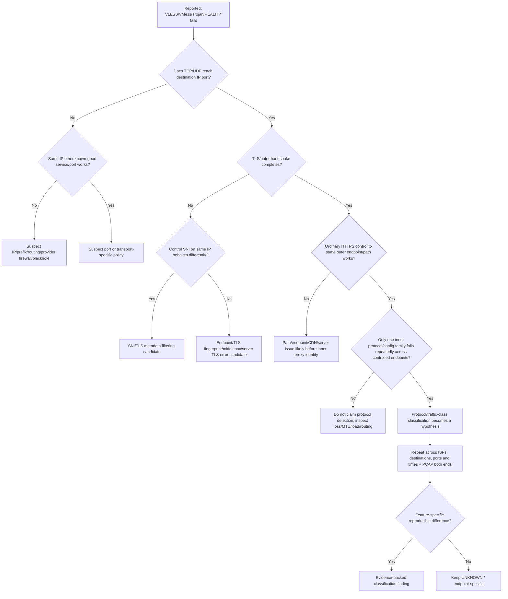

### The 15 common explanations behind “VLESS got filtered”

1. VLESS/protocol fingerprint classification;
2. destination IP block;
3. prefix/subnet block;
4. ASN-level reachability/policy effect;
5. SNI block;
6. DNS censorship;
7. TLS fingerprint/class rule;
8. destination port block;
9. generic UDP block;
10. QUIC-specific block;
11. provider routing/peering failure;
12. server firewall/provider abuse block;
13. server overload;
14. MTU/PMTUD failure;
15. packet loss/congestion.

Only controlled differential testing can distinguish them.

---

# 38. Iran-specific V2Ray/Xray evidence review

| Protocol / transport | Iran public evidence reviewed | Verdict |
|---|---|---|
| V2Ray/Xray as software family | User/community reports exist; generic filtering certainly affects deployments | `NOT INDEPENDENTLY CONFIRMED` as software-family identification |
| VMess / VMess AEAD | No controlled public Iran protocol-specific classifier found | `NO PUBLIC EVIDENCE` |
| VLESS raw | Wire structure parseable from source; no Iran deployment proof | `POSSIBLE`, deployment `UNKNOWN` |
| VLESS TLS | SNI/TLS filtering measured generally | `ENDPOINT/TLS FILTERING CONFIRMED — VLESS DETECTION UNPROVEN` |
| VLESS WS+TLS | Outer TLS visible; inner WS encrypted | `NO PUBLIC PROTOCOL-SPECIFIC EVIDENCE` |
| VLESS gRPC+TLS | Outer h2/TLS visible | `NO PUBLIC PROTOCOL-SPECIFIC EVIDENCE` |
| VLESS REALITY | Community claims only in reviewed material | `ANECDOTAL / NOT INDEPENDENTLY CONFIRMED` |
| XTLS Vision | No state-censor classifier proof | `NO PUBLIC EVIDENCE` |
| XHTTP/SplitHTTP | No state-censor classifier proof | `NO PUBLIC EVIDENCE` |
| Trojan/Trojan-Go | No Iran protocol-specific measurement found | `NO PUBLIC EVIDENCE` |
| Shadowsocks | Generic/proxy disruption reports plus Iran protocol filtering; exact current Shadowsocks classifier less direct than China | `POSSIBLE / OBSERVED disruption; dedicated current classifier not proven here` |
| WireGuard | Generic UDP disruption relevant | `UDP/endpoint disruption possible; protocol-specific detection UNKNOWN` |

**Important:** Iran's strong evidence for DPI and protocol whitelisting [I02] raises the prior probability that unfamiliar protocols may be denied during some policy regimes. It still does not prove the censor labels a flow “VLESS” or “REALITY.”

---

# 39. ISP/access differences in Iran

Measurements repeatedly show that Iran should not be modeled as one uniform path.

- OONI 2020: MCI AS197207, Irancell AS44244, TCI AS58224 and Shatel AS31549 produced different DoT reachability and failure patterns. [I05]
- IODA 2019: MCI, Irancell and Rightel lost connectivity around similar early timing, while fixed operators showed later/different signal behavior; ITC AS12880 retained BGP visibility despite data-plane collapse. [I09]
- 2026 monitoring again showed provider-level differences and staged restorations. [I14][I18]

For ADSL/VDSL/FTTH/TD-LTE/enterprise/datacenter access, **record the actual ASN and access type**. Do not infer behavior from the marketing access label alone.

---

# 40. Time-dependent filtering

Filtering can be permanent, campaign/event-driven, shutdown-only, policy-state dependent or temporarily inconsistent.

Examples:

- China Shadowsocks reports/measurements intensified from May 2019 onward; active probing was characterized in 2019–2020. [C01][C11]
- GFW fully-encrypted classifier appeared in early Nov 2021. [C02]
- China QUIC SNI mechanism first observed 2024-04-07. [C05]
- Iran shutdown/filtering behavior changed around 2019, 2022, June 2025, Jan 2026 and Feb–May 2026. [I09][I12][I13][I14][I17][I18]

Every PVNetwork observation should have a timestamp; an old packet trace is not evidence of present policy.

---

# 41. Port dependence

A censor can make decisions using port and protocol together, but port alone is not application identity.

Required comparisons:

- TCP/443 versus other TCP ports;
- TCP/80 plain HTTP controls;
- UDP/443 QUIC;
- high TCP/UDP ports;
- same endpoint/service across supported transports.

This file intentionally does not recommend ports for bypass. It treats port only as a measurement variable.

---

# 42. CDN and shared hosting

- Shared CDN IPs create collateral-damage pressure for IP blocking.
- A CDN terminates TLS when configured as the service front end; therefore the CDN sees HTTP semantics that an ordinary transit censor does not.
- WebSocket/H2/H3 can all be served behind a CDN when the CDN supports them.
- The origin address may not be on the client-visible path, but this is architecture, not proof of censor invisibility.
- SNI, destination CDN IP, TLS fingerprint and flow metadata remain available unless protected/changed by applicable standards such as ECH.

No domain-fronting or endpoint-hiding recipe is included.

---

# 43. Evidence-backed detection pipeline

| Pipeline stage | China | Iran | Confidence |
|---|---|---|---|
| Destination IP/prefix/ASN | Used/observable; endpoint blocks documented | Used/observable; broad address/UDP disruptions documented | `CONFIRMED` |
| Port/transport | Observable and policy-relevant | Observable and policy-relevant | `CONFIRMED` |
| DNS/HTTP Host/SNI | Large-scale measured | Large-scale/historical + recent measured | `CONFIRMED` |
| QUIC Initial/SNI | Explicitly reverse-engineered [C05] | QUIC censorship measured, exact classifier incomplete [I12] | CN `CONFIRMED`, IR `OBSERVED` |
| TLS fingerprint | Observable | Observable | Deployment details `UNKNOWN` |
| Fully-encrypted statistical classifier | Measured [C02] | Exact equivalent not shown | CN `CONFIRMED` |
| Protocol whitelister | Other GFW mechanisms differ | Measured [I02] | IR `CONFIRMED` in measured period |
| Active probe | Shadowsocks measured [C01] | Specific proxy families unconfirmed | CN `CONFIRMED` for SS |
| Enforcement | reset/drop/block/inject measured | inject/drop/disrupt/whitelist/shutdown measured | `CONFIRMED` |

---

# 44. Protocol Detection Matrix

| Protocol | Outer transport | Encryption | Ordinary SNI? | Passive detection evidence | Active probe evidence | China verdict | Iran verdict | Confidence |
|---|---|---|---:|---|---|---|---|---|
| VMess TCP | TCP | VMess encrypted | No TLS SNI | Fully-encrypted classifier affects VMess [C02] | Not VMess-specific here | `STRONGLY SUPPORTED` class detection | `NO PUBLIC EVIDENCE` specific | High CN / Low IR |
| VMess AEAD | TCP | AEAD/authenticated | No TLS SNI | Same class concern; source anti-replay [X04] | Unknown | `STRONGLY SUPPORTED` class detection | Unknown | Medium-High CN |
| VMess TLS | TLS/TCP | TLS + VMess | Yes unless ECH | Outer TLS + flow visible | Unknown | Outer TLS filter possible; VMess identity unproven | Same | Medium |
| VMess WS+TLS | WSS | TLS | Yes unless ECH | Outer TLS/flow visible | Unknown | Specific parser unproven | Specific parser unproven | Low |
| VLESS TCP | TCP | None at VLESS layer | N/A | Raw structured header technically parseable [X03] | None found | Deployment unknown | Deployment unknown | Source High / deployment Low |
| VLESS TLS | TLS/TCP | TLS | Yes unless ECH | Outer TLS visible | None found | VLESS-specific unproven | VLESS-specific unproven | Medium outer / Low inner |
| VLESS WS+TLS | WSS | TLS | Yes unless ECH | Outer TLS/statistics | None found | No public specific evidence | No public specific evidence | Low |
| VLESS gRPC+TLS | H2/TLS | TLS | Yes unless ECH | ALPN/outer TLS; gRPC encrypted | None found | No public specific evidence | No public specific evidence | Low |
| VLESS REALITY | TLS-like REALITY | TLS 1.3/uTLS-based | Outer SNI visible absent ECH | Outer fingerprint/flow [X05] | None found | No public specific evidence | Anecdotal only | Low |
| VLESS XTLS Vision | TLS/REALITY + Vision flow | TLS | Outer SNI as applicable | Flow/statistics visible | None found | No specific evidence | No specific evidence | Low |
| Trojan TLS | TLS | TLS | Yes unless ECH | Outer TLS/flow | None found | No public protocol-specific evidence | No public protocol-specific evidence | Low |
| Shadowsocks | TCP/UDP variants | Fully encrypted payload | No TLS SNI normally | First packet detection [C01] | Yes [C01] | `CONFIRMED PROTOCOL DETECTION` | Dedicated current classifier unclear | High CN |
| WireGuard | UDP | Encrypted VPN payload | No | Wire family technically recognizable | None established | Unknown | Unknown / generic UDP relevant | Low country-specific |
| Generic HTTPS | TLS/TCP | TLS | Yes unless ECH | SNI/TLS fields | N/A | SNI filtering confirmed | SNI/TLS filtering confirmed | High |
| Generic HTTP/2 | TLS/TCP | TLS | Yes unless ECH | ALPN + TLS metadata | N/A | Outer metadata filterable | Outer metadata filterable | High observable |
| Generic QUIC | UDP | QUIC/TLS | ClientHello recoverable in Initial | QUIC SNI parser confirmed | N/A | `CONFIRMED` [C05] | QUIC censorship observed [I12] | High CN / Medium IR |
| Generic HTTP/3 | QUIC | QUIC/TLS | As QUIC CH | QUIC Initial + flow | N/A | Same QUIC mechanism | QUIC policy observed | High CN / Medium IR |

---

# 45. Verdict per proxy protocol

| Protocol | China | Iran |
|---|---|---|
| Shadowsocks | `CONFIRMED PROTOCOL DETECTION` | `POSSIBLE / DISRUPTION OBSERVED IN BROADER FILTERING; CURRENT PROTOCOL-SPECIFIC CLASSIFIER NOT PROVEN HERE` |
| VMess | `STRONGLY SUPPORTED TRAFFIC-CLASS DETECTION` | `NO PUBLIC INDEPENDENT PROTOCOL-SPECIFIC EVIDENCE` |
| VMess AEAD | `STRONGLY SUPPORTED TRAFFIC-CLASS DETECTION` | `NO PUBLIC INDEPENDENT PROTOCOL-SPECIFIC EVIDENCE` |
| VLESS | `NO PUBLIC EVIDENCE OF DEDICATED PARSER` | `NO PUBLIC EVIDENCE OF DEDICATED PARSER` |
| Trojan | `NO PUBLIC PROTOCOL-SPECIFIC EVIDENCE` | `NO PUBLIC PROTOCOL-SPECIFIC EVIDENCE` |
| REALITY | `NO PUBLIC PROTOCOL-SPECIFIC EVIDENCE` | `ANECDOTAL / NOT INDEPENDENTLY CONFIRMED` |
| XTLS Vision | `NO PUBLIC PROTOCOL-SPECIFIC EVIDENCE` | `NO PUBLIC PROTOCOL-SPECIFIC EVIDENCE` |
| XHTTP/SplitHTTP | `NO PUBLIC PROTOCOL-SPECIFIC EVIDENCE` | `NO PUBLIC PROTOCOL-SPECIFIC EVIDENCE` |
| WireGuard | `UNKNOWN` | `UNKNOWN` (generic UDP/endpoint filtering may apply) |

---

# 46. Direct International Connectivity Without Tunnel

Definition:

```text
Client
  ↓
Iranian / Chinese ISP
  ↓
Domestic transit / policy path
  ↓
International gateway / upstream
  ↓
Foreign Internet
  ↓
Foreign server
```

No VPN/proxy/overlay tunnel is assumed.

### Why ordinary direct traffic can survive

Direct reachability is conditional on all relevant policy and network layers allowing the flow. Factors include:

- destination IP/prefix/ASN and reputation;
- destination organization/service class;
- TCP versus UDP;
- destination port;
- DNS result/dependency;
- SNI and TLS/QUIC metadata;
- HTTP Host for plaintext HTTP;
- CDN/shared-hosting behavior;
- IPv4/IPv6 route and policy;
- ISP/access network;
- time/event state;
- blacklist versus whitelist regime.

**There is no static “unfiltered transport” guarantee.** An ordinary HTTPS site may work while another site on the same protocol is blocked by SNI/IP/policy. Conversely, an IP may be reachable at TCP while its specific hostname is censored.

## Direct Access Matrix

| Transport | Visible metadata | China filtering | Iran filtering | Direct survivability | Confidence |
|---|---|---|---|---|---|
| TCP | IPs/ports/flags/sizes/timing | IP/port/state policies possible | Same | Conditional | High |
| UDP | IPs/ports/sizes/timing | QUIC-specific and generic policy possible | Broad UDP disruption measured | Conditional / more ambiguous | High |
| HTTP | Host/path/headers plaintext | Host filtering confirmed | Host/injection confirmed | Conditional | High |
| HTTPS TLS1.2 | IP + ClientHello/SNI + flow | SNI filtering confirmed | SNI/TLS interference confirmed | Conditional | High |
| HTTPS TLS1.3 | IP + ordinary ClientHello/SNI + flow | SNI filtering confirmed | SNI/TLS interference confirmed | Conditional | High |
| HTTP/2 | TLS metadata/ALPN, encrypted H2 frames | Outer metadata filterable | Outer metadata filterable | Conditional | High observable |
| QUIC | UDP + recoverable Initial CH | QUIC SNI filtering confirmed | QUIC censorship observed | Conditional | High CN / Medium IR |
| HTTP/3 | QUIC metadata | Same | Same | Conditional | High CN / Medium IR |
| DNS UDP | Plain query/response | Injection confirmed | Poisoning/injection confirmed | Conditional | High |
| DNS TCP | Plain DNS in TCP | Filterable | Temporary shutdown-related censorship observed | Conditional | Medium-High |
| DoH | HTTPS outer metadata | Endpoint/TLS policy possible | Endpoint/TLS policy possible | Conditional | High architecture |
| DoT | TLS + endpoint + port853 | Filterable | OONI measured non-uniform blocking | Conditional | High IR |
| IPv6 TCP | IPv6 + TCP + TLS as relevant | Filterable | IPv6 route availability/policy can differ | Conditional | Medium |
| IPv6 UDP | IPv6 + UDP | Filterable | IPv6 + UDP uncertainty high | Conditional | Medium-Low |

No working-IP or bypass-endpoint list is provided.

---

# 47. Detection Matrix by technique

| Technique | China | Iran | Passive/Active | Layer | Evidence |
|---|---|---|---|---|---|
| IP blocking | Yes | Yes | Passive policy | L3 | [C01][I03] |
| Prefix effects | Yes/possible | Yes/possible | Passive policy/routing | L3 | measurement dependent |
| DNS injection | Confirmed | Confirmed | Injection | DNS | [C03][I03] |
| HTTP Host | Confirmed | Confirmed/historical | Passive + enforcement | HTTP | [C04][I01] |
| TLS SNI | Confirmed | Confirmed/observed | Passive | TLS | [C04][I05][I06] |
| QUIC SNI | Confirmed | QUIC censorship observed, exact SNI parser incomplete | Passive | QUIC/TLS | [C05][I12] |
| TLS fingerprint | Observable; dedicated hash rule unknown | Observable; dedicated hash rule unknown | Passive | TLS | Standards + measurement context |
| Entropy / random-looking payload | Confirmed in GFW proxy detection | Exact equivalent not confirmed | Passive | Payload/statistical | [C01][C02] |
| Packet lengths | Confirmed as Shadowsocks feature | Technically observable | Passive | Flow | [C01] |
| Statistical flow analysis | Confirmed class heuristics | Possible; protocol whitelister confirmed | Passive | Flow | [C02][I02] |
| Protocol fingerprint | Confirmed | Confirmed in whitelister period | Passive | L7 | [C02][I02] |
| Active probing | Confirmed for Shadowsocks | Proxy-specific current proof absent | Active | Endpoint | [C01] |
| Replay probing | Confirmed for Shadowsocks research | Not confirmed here | Active | Endpoint | [C01][C11] |
| Throttling | Historical/varies | Historical measured | Passive enforcement | Flow | [I01] |
| Reset injection | Confirmed | Observed | Injection | TCP | [C04][I09] |
| Null/forwarding drop | Possible/observed in broad censorship | Strong shutdown evidence | Passive enforcement | L3/L4 | [I09][I14] |
| Whitelisting | Policy concepts differ | Strongly supported in 2026 shutdowns | Passive policy | Multi-layer | [I14][I15] |

---

# 48. OSI / protocol-layer matrix

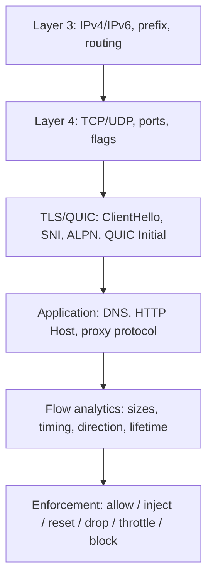

| Layer | Censor-observable examples | Typical failure evidence |
|---|---|---|
| L3 | IP, IPv6, prefix, route visibility | no route, blackhole, broad prefix failure |
| L4 | TCP/UDP, port, flags | SYN timeout, RST, UDP silence |
| TLS/QUIC | ClientHello, SNI, ALPN, QUIC Initial | handshake fails after ClientHello, QUIC-specific failure |
| Application | plaintext DNS/HTTP; raw protocol headers | forged DNS, blockpage/reset, protocol parse result |
| Flow | packet lengths/timing/direction | class-based blocking or throttling hypothesis |

---

# 49. Packet walkthroughs

## Case A — normal direct HTTPS foreign server

1. DNS query resolves hostname: censor may see plaintext DNS or only encrypted resolver transport metadata.
2. TCP SYN/SYN-ACK/ACK: censor sees IP/port/options/timing.
3. ClientHello: ordinary SNI and fingerprint fields visible.
4. ServerHello + TLS 1.3 handshake: later handshake becomes encrypted.
5. HTTPS request/response: content encrypted; flow sizes/timing visible.

If it succeeds, that proves only that this endpoint/hostname/transport was allowed at this time.

## Case B — HTTPS domain blocked by SNI

1. TCP handshake succeeds.
2. ClientHello contains target SNI.
3. failure/reset/drop begins consistently after ClientHello.
4. Control with another SNI on same endpoint/path behaves differently.

This differential result is much stronger than “site timed out.” China and Iran both have SNI-related measurement evidence. [C04][I05][I06]

## Case C — DNS-censored domain

1. Client sends plaintext DNS query.
2. censorship system observes name.
3. forged answer races/overrides legitimate answer or resolver path is manipulated.
4. Compare authoritative/control resolution and packet timing/IDs from multiple vantage points.

## Case D — IP-blocked destination

1. DNS may be correct.
2. SYN/UDP sent to target IP.
3. multiple unrelated hostnames/services on that IP/prefix fail similarly.
4. controlled route/foreign capture determines whether packets arrive.

## Case E — direct QUIC/HTTP3

1. UDP/443 QUIC Initial sent.
2. on-path observer can derive Initial keys and recover the ClientHello under QUIC v1 design. [S11]
3. ordinary SNI can be inspected; GFW is confirmed doing this at scale. [C05]
4. later 1-RTT traffic is encrypted, but metadata remains.

## Case F — fully-encrypted proxy-like TCP

1. TCP handshake succeeds.
2. first application bytes look random/fully encrypted.
3. GFW 2023 system can evaluate inexpensive byte/printable/protocol-exemption heuristics. [C02]
4. if policy classifies as suspicious, subsequent blocking can occur even without learning plaintext destination inside the proxy.

## Case G — VLESS / VMess / Trojan

- raw VLESS: structured first application header technically parseable. [X03]
- VMess AEAD: early auth/header material is cryptographically transformed; generic fully-encrypted classification is the stronger China evidence. [X04][C02]
- Trojan: TLS outer handshake visible; inner authentication/proxy request encrypted.
- with TLS/REALITY/WS/gRPC outer transports, first diagnose the **outer** path before asserting inner-protocol classification.

## Case H — suspected proxy endpoint followed by active probing

1. real client flow is passively observed.
2. endpoint IP:port becomes a suspicion candidate.
3. separate probe infrastructure initiates independent traffic.
4. server behavior is evaluated.
5. endpoint can be classified/blocked.

`CONFIRMED` for Shadowsocks in China; not proven for every Xray protocol or Iran. [C01]

---

# 50. How to Scientifically Detect Internet Filtering

## 50.1 Measurement stack

- OONI Probe / OONI Explorer for standardized censorship measurements;
- IODA for BGP versus active-probing/telescope outage signals;
- RIPE Atlas for distributed DNS/ping/traceroute measurements;
- Cloudflare Radar for traffic/protocol/announcement trends;
- `traceroute` / `mtr` for path and loss observations;
- `dig` for controlled DNS comparisons;
- `curl` for HTTP(S) transactions and protocol selection;
- TLS handshake tooling for SNI/ALPN/certificate/alert outcomes;
- QUIC clients/servers for controlled QUIC tests;
- `tcpdump` / Wireshark for packet evidence;
- a controlled foreign server for two-sided PCAP/logging;
- multiple Iranian/Chinese ISPs/ASNs and external control vantage points.

## 50.2 Reproducibility requirements

Every test should record:

- exact UTC timestamp;
- client ASN/provider/access type;
- public IPv4/IPv6 state;
- destination IP/ASN and hostname category;
- transport/port;
- protocol + outer transport;
- resolver used and DNS result;
- TCP/UDP handshake/outcome;
- TLS/QUIC version, SNI test class and ALPN;
- PCAP hashes or immutable artifact IDs;
- server-side arrival logs;
- control-test result;
- retry count and time window.

Never publish credentials, raw user UUIDs, authentication material or sensitive payload content in shared telemetry.

---

# 51. PCAP analysis checklist

For diagnosis, inspect in order:

1. **DNS query/response:** query name/type, resolver, response IPs, timing, duplicate/competing answers.
2. **TCP SYN:** did it leave client? Did controlled server receive it?
3. **SYN/ACK:** did server generate it? Did client receive it?
4. **ACK / establishment:** is three-way handshake complete?
5. **ClientHello:** exact SNI class, version, ALPN, extensions, record boundaries.
6. **ServerHello:** did it arrive?
7. **TLS Alert / EOF / RST:** who appears to originate it, sequence/TTL consistency, timing.
8. **Retransmissions:** one direction or both?
9. **ICMP:** unreachable, fragmentation-needed / Packet Too Big, TTL exceeded.
10. **QUIC Initial:** version/DCID, Initial retransmission, server response.
11. **RTT/loss:** baseline versus target and control.
12. **Server capture:** absence/presence is often decisive for locating the drop.

---

# 52. Control experiments

Minimum conceptual controls:

```text
Same ISP + same client + same foreign region + different protocol
Same protocol + different destination
Same destination + different ISP/ASN
Same hostname + IPv4 versus IPv6
Same server + TCP versus UDP
Same IP + different SNI (where the controlled service supports it)
Same setup + repeated times/days
```

A censorship finding should survive reasonable repetition and include a non-censored control.

---

# 53. How Not to Misdiagnose Censorship

| False-positive cause | Distinguishing evidence |
|---|---|
| Congestion | broad RTT/queue/loss correlation; multiple destinations affected; time/load dependence |
| Packet loss | random loss/retransmissions without feature-specific boundary |
| MTU/PMTUD | small packets work; large TLS/data stalls; ICMP PTB missing; MSS-size controls help diagnose |
| Bad peering | path/ASN-specific loss, affects unrelated protocols/destinations on same route |
| Asymmetric routing | two-sided traceroute/PCAP shows different paths/one-way failure |
| Server firewall | foreign control clients fail similarly or server logs local drop |
| Geo-blocking | application/server-generated denial; outside censor path controls correlate with geography |
| Sanctions/provider policy | provider-level denial/account policy independent of national middlebox behavior |
| CDN policy | edge-generated response/status; other origins differ |
| DNS outage | authoritative/resolver failures also outside censored network |
| Rate limit | success at low rate, server/edge responses indicate quota |
| CGNAT | UDP mapping/timeouts/shared source behavior; not content/SNI correlated |
| IPv6 failure | AAAA path fails while A succeeds; route/RA/PMTUD checks |
| TLS config error | standards-compliant clients fail from controls too; server alerts/logs |
| QUIC disabled server-side | UDP/443 absent from all controls; TCP HTTPS succeeds |
| Server overload | CPU/run queue/connection backlog correlates with failure |

---

# 54. China versus Iran capability matrix

| Capability | China | Iran | Confidence |
|---|---|---|---|
| DNS injection/poisoning | Confirmed | Confirmed | High |
| Exact IP blocking | Confirmed in broader system | Confirmed/observed | High |
| Prefix blocking/effects | Possible/observed depending campaign | Observed in shutdown/routing contexts | Medium |
| SNI filtering | Confirmed | Confirmed/observed | High |
| QUIC SNI parsing | Confirmed [C05] | QUIC censorship observed; exact SNI parser not fully proven | High CN / Medium IR |
| HTTP Host filtering | Confirmed | Confirmed | High |
| TCP reset injection | Confirmed | Observed | High |
| TLS fingerprinting as observable feature | Yes | Yes | High observable |
| Specific JA3/JA4 censorship rule | Not independently confirmed here | Not independently confirmed here | Low |
| Passive proxy detection | Confirmed | Generic protocol classification confirmed | High CN / Medium-High IR |
| Fully-encrypted classifier | Confirmed | Exact equivalent unknown | High CN |
| Active probing | Confirmed for Shadowsocks | Proxy-specific proof absent | High CN |
| Replay probing | Confirmed for Shadowsocks | Unknown | High CN |
| Protocol detection | Confirmed for several traffic classes | Protocol whitelister confirmed historically | High in scoped studies |
| Intentional throttling | Historical/variable | Historical measured | Medium/history-specific |
| Regional filtering | Confirmed Henan layer | Provider/regional differences observed | High CN regional; Medium IR |
| Whitelist mode | Not characterized here as Iran-style national shutdown policy | Strongly supported 2026 | High IR |
| Shutdown | Selective censorship, not Iran-style timeline focus here | Confirmed recurrent | High IR |
| BGP effects | Not central to reviewed GFW packet studies | Confirmed in some shutdowns | High IR |
| Forwarding drop with BGP retained | Plausible | Confirmed 2019; strongly supported 2026 | High IR |
| IPv6 filtering/effects | DNS/IPv6 censorship evidence | Major 2026 IPv6 route effects | High scoped |
| VMess traffic-class detection | Strongly supported [C02] | Protocol-specific unknown | High CN |
| VLESS-specific detection | No public evidence | No public evidence | Low/unknown |
| Trojan-specific detection | No public evidence | No public evidence | Low/unknown |
| REALITY-specific detection | No public evidence | Anecdotal only | Low/unknown |
| WireGuard-specific detection | Unknown | Unknown | Low |

---

# 55. Timelines

## China

| Year/date | Technique/event | Evidence | Confidence |
|---|---|---|---|
| 2015-04 | Great Cannon injection system characterized as separate but co-located with GFW | [C09] | `CONFIRMED` scoped |
| 2019-05 onward | Shadowsocks blocking reports; later experimentally characterized | [C01][C11] | `CONFIRMED` by later measurement |
| 2020 | IMC paper: first-packet length/entropy + staged active probing for Shadowsocks | [C01] | `CONFIRMED` |
| 2020-07 | ESNI blocking reported/measured | [C08] | `OBSERVED` historical |
| 2021 | GFWatch longitudinal DNS censorship results | [C03] | `CONFIRMED` |
| 2021-11 | Fully-encrypted TCP classifier begins; later characterized | [C02] | `CONFIRMED` |
| 2024 | GFWeb large-scale HTTP/HTTPS filtering study | [C04] | `CONFIRMED` |
| 2024-04-07 | QUIC SNI censorship first observed | [C05] | `CONFIRMED` |
| 2025-05 | Regional Henan censorship paper | [C06] | `CONFIRMED` |
| 2025-08 | USENIX Security publishes GFW QUIC Initial/SNI study | [C05] | `CONFIRMED` |
| 2026-02-19 | FOCI Geedge leak measurement work presented; vendor-side datasets include China-related material | [C10] | `OBSERVED`; vendor capability != national deployment |

## Iran

| Year/date | Technique/event | Evidence | Confidence |
|---|---|---|---|
| 2009–2012 | Earlier censorship/shutdown evolution documented by later studies; packet-level claims should use period-specific sources | historical context | `INFERRED/secondary unless separately measured` |
| 2013 | HTTP Host, keyword, DNS hijack, protocol throttling; centralized topology evidence | [I01] | `OBSERVED` |
| 2019-11-16 | Nationwide shutdown; mixed BGP/data-plane mechanisms, per-AS timing, RST observations | [I09] | `CONFIRMED` |
| 2020 | Protocol whitelister measured | [I02] | `CONFIRMED` |
| 2020-05/06 | OONI DoT/SNI/TLS endpoint heterogeneity | [I05][I06] | `OBSERVED` |
| 2022 | Recurrent disruptions analyzed by IODA and other monitors | [I18] | `OBSERVED` |
| 2023–2025 | Multi-AS measurement work continues; heterogeneity emphasized | [I04] | `OBSERVED` |
| 2025 | IRBlock large-scale DNS/HTTP/UDP study | [I03] | `CONFIRMED` |
| 2025-06 | Wartime shutdown; DNS/HTTP/TLS/QUIC measurements | [I12] | `OBSERVED` |
| 2026-01-08 | Near-total shutdown; IPv6 announced space drops 98.5% first | [I13] | `CONFIRMED telemetry` |
| 2026-02-28 | Second shutdown; traffic <1% while IPv4 announcements largely stable | [I14] | `CONFIRMED telemetry` |
| 2026-05-26/27 | Partial restoration begins | [I16] | `CONFIRMED telemetry` |
| 2026-07-28 | Cloudflare Q2 review: post-restoration traffic still below normal baseline | [I17] | `OBSERVED telemetry` |

---

# 56. Implications for PVNetwork

PVNetwork should treat “censorship” as one branch in a structured incident taxonomy, not a default explanation.

Potential causes of user-visible failures:

- routing / bad peering;
- congestion / packet loss;
- censorship policy;
- protocol/traffic-class detection;
- destination IP/prefix block;
- DNS manipulation;
- SNI/TLS metadata filtering;
- generic UDP/UDP443 policy;
- MTU/PMTUD;
- server CPU/NIC/conntrack overload;
- provider firewall/abuse policy;
- CDN/origin failure.

## 56.1 Recommended telemetry schema

For each test record:

- `timestamp_utc`
- `client_isp`
- `client_asn`
- `access_type`
- `client_ipv4_available`
- `client_ipv6_available`
- `destination_ip`
- `destination_asn`
- `transport` (`TCP`/`UDP`)
- `destination_port`
- `inner_protocol`
- `outer_transport`
- `dns_resolver_class`
- `dns_response_class`
- `tcp_handshake_result`
- `tls_handshake_result`
- `sni_test_class` (avoid storing unnecessary sensitive hostnames in broad telemetry)
- `quic_result`
- `rtt_ms`
- `packet_loss_pct`
- `retransmissions`
- `tcp_rst_observed`
- `throughput_down_up`
- `control_test_id`
- `pcap_artifact_hash` where privacy policy permits
- `server_side_arrival_result`

Do not store proxy credentials, raw UUIDs, session secrets, user content or unnecessarily identifying payloads.

## 56.2 Iran Measurement Matrix template

These rows are **not measurements**. They are an explicit run sheet; all unmeasured cells remain `NOT TESTED`.

| Date | ISP | ASN | Access | IPv4 | IPv6 | DNS | TCP443 | UDP443 | TLS | SNI | QUIC | VMess | VLESS | Trojan | REALITY |
|---|---|---|---|---|---|---|---|---|---|---|---|---|---|---|---|
| NOT TESTED | MCI | AS197207 | Mobile | NOT TESTED | NOT TESTED | NOT TESTED | NOT TESTED | NOT TESTED | NOT TESTED | NOT TESTED | NOT TESTED | NOT TESTED | NOT TESTED | NOT TESTED | NOT TESTED |
| NOT TESTED | Irancell | AS44244 | Mobile | NOT TESTED | NOT TESTED | NOT TESTED | NOT TESTED | NOT TESTED | NOT TESTED | NOT TESTED | NOT TESTED | NOT TESTED | NOT TESTED | NOT TESTED | NOT TESTED |
| NOT TESTED | TCI | AS58224 | Fixed | NOT TESTED | NOT TESTED | NOT TESTED | NOT TESTED | NOT TESTED | NOT TESTED | NOT TESTED | NOT TESTED | NOT TESTED | NOT TESTED | NOT TESTED | NOT TESTED |
| NOT TESTED | Shatel | AS31549 | Fixed | NOT TESTED | NOT TESTED | NOT TESTED | NOT TESTED | NOT TESTED | NOT TESTED | NOT TESTED | NOT TESTED | NOT TESTED | NOT TESTED | NOT TESTED | NOT TESTED |
| NOT TESTED | Rightel | AS57218 | Mobile | NOT TESTED | NOT TESTED | NOT TESTED | NOT TESTED | NOT TESTED | NOT TESTED | NOT TESTED | NOT TESTED | NOT TESTED | NOT TESTED | NOT TESTED | NOT TESTED |

## 56.3 PVNetwork incident flowchart

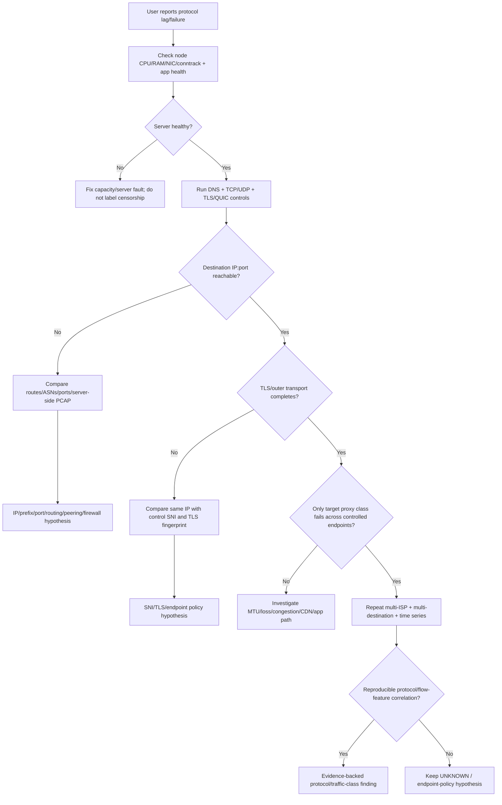

---

# 57. What We Know vs What We Think We Know

## Confirmed

- China performs large-scale DNS censorship/injection, HTTP/HTTPS Host/SNI filtering, fully-encrypted traffic classification, Shadowsocks active probing, and QUIC Initial/SNI inspection. [C01][C02][C03][C04][C05]
- China has at least one measured additional regional censorship layer (Henan) beyond the national GFW model. [C06]
- Iran has measured DNS/HTTP censorship, SNI/TLS interference, generic protocol whitelisting/fingerprinting in a measured period, large-scale UDP disruption, and event-driven shutdown mechanisms. [I01][I02][I03][I05][I09][I12]
- Iran shutdowns can preserve BGP announcements while the data plane is effectively unavailable. [I09][I14]
- Ordinary TLS does not hide IP/port/flow metadata or the ordinary ClientHello/SNI; ECH is specifically designed to encrypt the sensitive inner ClientHello. [S09][S18]
- QUIC Initial encryption does not provide confidentiality against an on-path observer because Initial keys are publicly derivable; China has demonstrated operational use of this fact for SNI filtering. [S11][C05]
- Xray raw VLESS has a structured first application header; VMess AEAD uses cryptographically transformed AuthID material; REALITY uses uTLS-based ClientHello construction; XHTTP/SplitHTTP is HTTP-semantic. [X03][X04][X05][X06]

## Probable / Strongly Supported

- A distributed multi-layer architecture (access/provider + backbone/gateway policy + protocol-specific systems) is a better model than a single monolithic firewall in both countries.
- Iran's 2026 international restrictions used aggressive forwarding/filter/whitelist-style controls in addition to or instead of BGP withdrawal, depending on the event. [I13][I14][I15]
- VMess traffic can be caught by China's general fully-encrypted classifier even when the censor does not parse VMess semantics. [C02]

## Unknown / Needs Measurement

- Exact 2026 device/vendor topology and placement of every Iran/China filtering component.
- Universal country-wide use of JA3/JA4 as a censorship rule.
- A dedicated Iran VMess, VLESS, Trojan, REALITY, Vision or XHTTP protocol classifier.
- A dedicated China VLESS, Trojan, REALITY, Vision or XHTTP parser/classifier.
- Iran VMess/VLESS/Trojan/REALITY active-probe confirmation pipeline.
- Exact equivalence between Iran's measured QUIC censorship and China's QUIC-Initial SNI implementation.
- Uniform IPv4/IPv6 policy parity across all providers/regions.

---

# 58. Final answer to the core research question

When a packet travels directly from an Iranian or Chinese user to a foreign server, access-network equipment, ISP/core routers, domestic transit/backbone, international-facing transit and attached censorship systems can observe at least routing and flow metadata. NAT/CGNAT may rewrite the client address, but destination IP/port, transport, sizes, direction and timing remain available along the path. Plain DNS and HTTP expose application names/headers directly. Ordinary TLS protects application content but leaves the ClientHello — notably SNI and fingerprintable handshake features — visible; TLS 1.3 encrypts more of the later handshake but does not remove this metadata. ECH changes that by encrypting the private ClientHello, while still exposing outer connection metadata. QUIC's Initial packet is recoverable by an on-path observer under the standard's public Initial-key design, and the GFW has been independently measured using that capability to filter SNI. [S09][S11][S18][C05]

A censor can classify destination and traffic progressively: IP/prefix/ASN and port first; DNS/HTTP/SNI/TLS/QUIC metadata next; protocol/implementation fingerprints and flow statistics next; then, in systems where it is demonstrated, active probing can confirm a suspected endpoint. China provides the clearest public example: Shadowsocks uses first-packet length/entropy suspicion followed by active probing, and a later GFW system passively classifies fully-encrypted traffic using efficient byte/protocol-exemption heuristics that explicitly affect VMess. [C01][C02]

For VLESS, Trojan and REALITY, source analysis explains what is technically visible but does not justify claiming national-censor protocol detection. Raw VLESS is structurally parseable; VLESS inside TLS/REALITY/WS/gRPC hides its inner header from ordinary transit DPI behind the outer channel. Trojan's proxy authentication is inside TLS. REALITY uses uTLS-based outer handshake behavior, so its outer TLS metadata and flow remain observable. Public evidence reviewed here does not independently prove dedicated VLESS/Trojan/REALITY parsers in China or Iran. [X03][X05]

Therefore the scientific way to distinguish protocol filtering from IP/SNI/DNS/routing/congestion is differential measurement: same destination with controlled SNI/protocol changes; same protocol across different destinations; same destination across ISPs/ASNs; IPv4 versus IPv6; TCP versus UDP; two-sided PCAP/logging; and repeated time controls. A protocol-detection claim becomes credible only when failures reproducibly track a protocol/flow feature while endpoint, path, server health and ordinary transport controls remain healthy.

---

# 59. Sources

**Source count in this reference: 61** (`18 standards + 11 China-specific + 18 Iran-specific + 7 measurement/general + 7 protocol/source-code`). Accessed/validated on **2026-08-18** unless an explicit publication date is shown.

## Standards / RFCs

| ID | Source | Organization | Date | Type | Peer reviewed | Used for |
|---|---|---|---|---|---|---|
| S01 | [RFC 791 — Internet Protocol](https://www.rfc-editor.org/rfc/rfc791) | IETF/RFC Editor | 1981-09 | Standard | N/A | IPv4 |
| S02 | [RFC 8200 — IPv6 Specification](https://www.rfc-editor.org/rfc/rfc8200) | IETF/RFC Editor | 2017-07 | Standard | N/A | IPv6 |
| S03 | [RFC 9293 — Transmission Control Protocol](https://www.rfc-editor.org/rfc/rfc9293) | IETF/RFC Editor | 2022-08 | Standard | N/A | TCP |
| S04 | [RFC 768 — User Datagram Protocol](https://www.rfc-editor.org/rfc/rfc768) | IETF/RFC Editor | 1980-08 | Standard | N/A | UDP |
| S05 | [RFC 1034 — Domain Names: Concepts and Facilities](https://www.rfc-editor.org/rfc/rfc1034) | IETF/RFC Editor | 1987-11 | Standard | N/A | DNS concepts |
| S06 | [RFC 1035 — Domain Names: Implementation and Specification](https://www.rfc-editor.org/rfc/rfc1035) | IETF/RFC Editor | 1987-11 | Standard | N/A | DNS wire format |
| S07 | [RFC 6066 — TLS Extensions / SNI](https://www.rfc-editor.org/rfc/rfc6066) | IETF/RFC Editor | 2011-01 | Standard | N/A | SNI |
| S08 | [RFC 5246 — TLS 1.2](https://www.rfc-editor.org/rfc/rfc5246) | IETF/RFC Editor | 2008-08 | Historic TLS standard | N/A | TLS 1.2 comparison |
| S09 | [RFC 9846 — TLS 1.3](https://www.rfc-editor.org/rfc/rfc9846) | IETF/RFC Editor | 2026-07 | Standards Track | N/A | Current TLS 1.3 specification |
| S10 | [RFC 9000 — QUIC](https://www.rfc-editor.org/rfc/rfc9000) | IETF/RFC Editor | 2021-05 | Standard | N/A | QUIC transport |
| S11 | [RFC 9001 — Using TLS to Secure QUIC](https://www.rfc-editor.org/rfc/rfc9001) | IETF/RFC Editor | 2021-05 | Standard | N/A | QUIC Initial keys / TLS |
| S12 | [RFC 9113 — HTTP/2](https://www.rfc-editor.org/rfc/rfc9113) | IETF/RFC Editor | 2022-06 | Standard | N/A | HTTP/2 |
| S13 | [RFC 9114 — HTTP/3](https://www.rfc-editor.org/rfc/rfc9114) | IETF/RFC Editor | 2022-06 | Standard | N/A | HTTP/3 |
| S14 | [RFC 8484 — DNS Queries over HTTPS](https://www.rfc-editor.org/rfc/rfc8484) | IETF/RFC Editor | 2018-10 | Standard | N/A | DoH |
| S15 | [RFC 7858 — DNS over TLS](https://www.rfc-editor.org/rfc/rfc7858) | IETF/RFC Editor | 2016-05 | Standard | N/A | DoT |
| S16 | [RFC 9460 — SVCB and HTTPS DNS Records](https://www.rfc-editor.org/rfc/rfc9460) | IETF/RFC Editor | 2023-11 | Standard | N/A | SVCB/HTTPS |
| S17 | [RFC 9848 — Bootstrapping TLS Encrypted ClientHello with DNS SVCB/HTTPS](https://www.rfc-editor.org/rfc/rfc9848) | IETF/RFC Editor | 2026-03 | Standards Track | N/A | ECH config discovery |
| S18 | [RFC 9849 — TLS Encrypted Client Hello](https://www.rfc-editor.org/rfc/rfc9849) | IETF/RFC Editor | 2026-03 | Standards Track | N/A | ECH inner/outer model |

## China-specific measurement/research

| ID | Source | Organization / venue | Date | Type | Peer reviewed | Used for |
|---|---|---|---|---|---|---|
| C01 | [How China Detects and Blocks Shadowsocks](https://conferences.sigcomm.org/imc/2020/paper-access/) — Alice, Bob, Carol, Jan Beznazwy, Amir Houmansadr; DOI `10.1145/3419394.3423644` | ACM IMC | 2020 | Paper | Yes | First-packet length/entropy; active probing |
| C02 | [How the Great Firewall of China Detects and Blocks Fully Encrypted Traffic](https://www.usenix.org/conference/usenixsecurity23/presentation/wu-mingshi) — Wu et al. | USENIX Security | 2023-08 | Paper | Yes | Fully-encrypted classifier; VMess |
| C03 | [How Great is the Great Firewall? Measuring China's DNS Censorship](https://www.usenix.org/conference/usenixsecurity21/presentation/hoang) — Hoang et al. | USENIX Security | 2021 | Paper | Yes | DNS injection/poisoning |
| C04 | [GFWeb: Measuring the Great Firewall's Web Censorship at Scale](https://www.usenix.org/conference/usenixsecurity24/presentation/hoang) — Hoang et al. | USENIX Security | 2024 | Paper | Yes | HTTP/HTTPS Host/SNI, bidirectional behavior |
| C05 | [Exposing and Circumventing SNI-based QUIC Censorship of the Great Firewall of China](https://www.usenix.org/conference/usenixsecurity25/presentation/zohaib) — Zohaib et al. | USENIX Security | 2025-08 | Paper | Yes | QUIC Initial/SNI censorship |
| C06 | [A Wall Behind A Wall: Emerging Regional Censorship in China](https://www.ieee-security.org/TC/SP2025/accepted-papers.html) — Wu, Zohaib, Durumeric, Houmansadr, Wustrow; DOI `10.1109/SP61157.2025.00152` | IEEE S&P | 2025-05 | Paper | Yes | Henan regional filtering |
| C07 | [On the Importance of Encrypted-SNI to Censorship Circumvention](https://www.usenix.org/conference/foci19/presentation/chai) — Chai, Ghafari, Houmansadr | USENIX FOCI | 2019 | Workshop paper | Reviewed workshop | SNI censorship context |
| C08 | [Exposing and Circumventing China's Censorship of ESNI](https://gfw.report/blog/gfw_esni_blocking/en/) | GFW Report | 2020 | Measurement report | No | Historical ESNI blocking |
| C09 | [China's Great Cannon](https://citizenlab.ca/research/chinas-great-cannon/) — Marczak et al. | Citizen Lab | 2015-04-10 | Technical report | No | Injection architecture / separate system |
| C10 | [Geedge Cases: Censorship Measurement Insights from the Geedge Networks Leak](https://www.petsymposium.org/foci/2026/foci-2026-0006.php) — Sheffey, Zohaib, Wu, Houmansadr | FOCI | 2026-02 | Workshop paper | Reviewed workshop | Vendor-side censorship datasets; deployment caveat |
| C11 | [GFW Report research index](https://gfw.report/en/) | GFW Report | ongoing, accessed 2026-08-18 | Measurement index | No | Longitudinal cross-check / preliminary Shadowsocks report |

## Iran-specific measurement/research

| ID | Source | Organization / venue | Date | Type | Peer reviewed | Used for |
|---|---|---|---|---|---|---|
| I01 | [Internet Censorship in Iran: A First Look](https://www.usenix.org/conference/foci13/workshop-program/presentation/aryan) — Aryan, Aryan, Halderman | USENIX FOCI | 2013 | Workshop paper | Reviewed workshop | HTTP/DNS/throttling/topology |
| I02 | [Detecting and Evading Censorship-in-Depth: A Case Study of Iran's Protocol Whitelister](https://www.usenix.org/conference/foci20/presentation/bock) — Bock et al. | USENIX FOCI | 2020-08 | Workshop paper | Reviewed workshop | Protocol whitelister |
| I03 | [IRBlock: A Large-Scale Measurement Study of the Great Firewall of Iran](https://www.usenix.org/conference/usenixsecurity25/presentation/tai) — Tai et al. | USENIX Security | 2025-08 | Paper | Yes | DNS/HTTP/UDP large-scale censorship |
| I04 | [Measuring Censorship in Iran Using Refraction-based Proxies](https://ericw.us/trow/pub.html) — Abdulrahman Alaraj, Eric Wustrow | ACM AsiaCCS | 2025 | Paper | Yes | Multi-AS / heterogeneous censorship |
| I05 | [DNS over TLS blocked in Iran](https://ooni.org/post/2020-iran-dot/) — Simone Basso | OONI | 2020-06-24 | Measurement report | No | ISP-specific DoT/TLS/SNI/endpoint blocking |
| I06 | [Measuring SNI based blocking in Iran](https://ooni.org/post/2020-iran-sni-blocking/) | OONI | 2020 | Measurement report | No | SNI blocking |
| I07 | [OONI Explorer — Censorship Findings: Iran](https://explorer.ooni.org/findings) | OONI | ongoing | Measurement dataset/index | No | Current/historical service measurements |
| I08 | [Iran blocked WhatsApp amid war with Israel](https://explorer.ooni.org/findings) | OONI | 2025-08-15 | Measurement finding | No | 2025 service-block timeline |
| I09 | [Iran's nation-wide Internet blackout: Measurement data and technical observations](https://ioda.inetintel.cc.gatech.edu/reports/irans-nation-wide-internet-blackout-measurement-data-and-technical-observations/) — Padmanabhan et al. | IODA/CAIDA + OONI | 2019-11-23 | Measurement report | No | BGP vs data plane; ASN differences; RST |
| I10 | [Internet shutdowns / Iran](https://pulse.internetsociety.org/) | Internet Society Pulse | ongoing | Monitoring | No | Shutdown/NIN context |
| I11 | [I(ra)nconsistencies: Novel Insights into Iran's Censorship](https://www.petsymposium.org/foci/2025/foci-2025-0002.php) — Lange et al. | FOCI / PoPETs | 2025 | Paper | Reviewed workshop | DNS/HTTP inconsistencies |
| I12 | [Insights into an Iranian Internet Shutdown](https://www.petsymposium.org/foci/2026/foci-2026-0016.php) — Anonymous, Niere, Graf Lange, Somorovsky | FOCI | 2026 | Workshop paper | Reviewed workshop | June 2025 DNS/HTTP/TLS/QUIC shutdown measurements |
| I13 | [What we know about Iran's Internet shutdown](https://blog.cloudflare.com/iran-protests-internet-shutdown/) — David Belson | Cloudflare Radar | 2026-01-13 | Telemetry report | No | Jan 2026 IPv6/traffic collapse |
| I14 | [Shutdowns, power outages, and conflict: Q1 2026 Internet disruptions](https://blog.cloudflare.com/q1-2026-internet-disruption-summary/) | Cloudflare Radar | 2026-04 | Telemetry report | No | Feb 28 shutdown; stable IPv4 announcements |
| I15 | [Total Blackout: A Technical Breakdown of the January 2026 Shutdown](https://filter.watch/english/2026/01/16/investigative-report-technical-breakdown-of-the-january-2026-shutdown/) | Filterwatch | 2026-01-16 | Investigative/measurement synthesis | No | Whitelist interpretation/NIN |
| I16 | [Iran's Internet is partially restored, Cloudflare Radar data shows](https://blog.cloudflare.com/iran-internet-partially-restored-may-2026/) | Cloudflare Radar | 2026-05-27 | Telemetry report | No | Restoration timeline |
| I17 | [Natural disasters and government interference: Q2 2026's major Internet disruption event](https://blog.cloudflare.com/q2-2026-internet-disruption-summary/) | Cloudflare Radar | 2026-07-28 | Telemetry report | No | Latest macro Iran connectivity evidence in this review |
| I18 | [A Comparative Look at Internet Shutdowns in Iran: 2019, 2022, 2025, and 2026](https://ioda.inetintel.cc.gatech.edu/reports/a-comparative-look-at-internet-shutdowns-in-iran-2019-2022-2026-and-2026/) | IODA | 2026 | Measurement synthesis | No | BGP/active probing/telescope comparison |

## General measurement sources

| ID | Source | Organization | Date | Type | Peer reviewed | Used for |
|---|---|---|---|---|---|---|
| G01 | [OONI documentation / Explorer](https://ooni.org/) | OONI | ongoing | Measurement platform | No | Reproducible censorship tests |
| G02 | [RIPE Atlas documentation](https://atlas.ripe.net/docs/) | RIPE NCC | ongoing | Measurement platform | No | Distributed ping/DNS/traceroute |
| G03 | [IODA](https://ioda.inetintel.cc.gatech.edu/) | Georgia Tech / Internet Intelligence Lab | ongoing | Measurement platform | No | BGP vs active-probing/telescope outage signals |
| G04 | [Cloudflare Radar](https://radar.cloudflare.com/) | Cloudflare | ongoing | Internet telemetry | No | Traffic/protocol/route trends |
| G05 | [Internet Society Pulse](https://pulse.internetsociety.org/) | Internet Society | ongoing | Monitoring | No | Shutdown context |
| G06 | [Censored Planet](https://censoredplanet.org/) | University research project | ongoing | Censorship measurement | Research platform | Cross-country measurement methodology |
| G07 | [Citizen Lab test lists](https://github.com/citizenlab/test-lists) | Citizen Lab | ongoing | Measurement corpus | No | Control/test-domain methodology |

## Protocol/source-code references

| ID | Source | Repository / pin | Date | Type | Peer reviewed | Used for |
|---|---|---|---|---|---|---|
| X01 | [XTLS/Xray-core](https://github.com/XTLS/Xray-core) | release `v26.3.27`; commit `d2758a023cd7f4174a5a5fa4ff66e487d4342ba0` | 2026-03-27 | Canonical source | N/A | Xray wire behavior |
| X02 | [v2fly/v2ray-core](https://github.com/v2fly/v2ray-core) | release `v5.52.0`; commit `9db9c4bb0cd92d18064f8c430cca641b5c49ea43` | 2026-07-07 | Canonical source | N/A | V2Ray current pin |
| X03 | [Xray VLESS encoding module](https://github.com/XTLS/Xray-core/blob/v26.3.27/proxy/vless/encoding/encoding.go) | `v26.3.27` | 2026-03-27 | Source file | N/A | Raw VLESS request header/framing |
| X04 | [Xray VMess AEAD AuthID](https://github.com/XTLS/Xray-core/blob/v26.3.27/proxy/vmess/aead/authid.go) | `v26.3.27` | 2026-03-27 | Source file | N/A | AEAD AuthID / anti-replay |
| X05 | [Xray REALITY implementation](https://github.com/XTLS/Xray-core/blob/v26.3.27/transport/internet/reality/reality.go) | `v26.3.27` | 2026-03-27 | Source file | N/A | uTLS/TLS1.3/REALITY handshake behavior |
| X06 | [Xray SplitHTTP/XHTTP configuration/source](https://github.com/XTLS/Xray-core/blob/v26.3.27/transport/internet/splithttp/config.go) | `v26.3.27` | 2026-03-27 | Source file | N/A | XHTTP/SplitHTTP HTTP semantics |
| X07 | [p4gefau1t/trojan-go](https://github.com/p4gefau1t/trojan-go) | latest release observed `v0.10.6` | 2021-09-14 | Canonical project source | N/A | Trojan-Go architecture age/pin |

---

# 60. Citation-validation and maintenance notes

1. Source IDs in this file intentionally separate standards, country measurements and source code.
2. `C10`/Geedge is a **vendor-leak measurement source**. It is not proof that every vendor capability is deployed by the national GFW or Iran.
3. Historical findings (for example Iran 2013 and China ESNI 2020) are labeled as historical and must not be promoted to “current 2026” without new measurement.
4. FOCI papers are marked `Reviewed workshop` rather than silently equating them with USENIX Security/IEEE S&P main-conference papers.
5. The newest China-related research source in this reference is FOCI 2026 Geedge (`2026-02-19` program), but the newest directly characterized national-GFW packet-level mechanism in the core set is the USENIX Security 2025 QUIC study. [C05][C10]
6. The newest Iran macro-connectivity evidence in this reference is Cloudflare's `2026-07-28` Q2 review. [I17]
7. If future measurements contradict any verdict, preserve the old observation with its date and update the “last independently confirmed” state instead of rewriting history.

---

## Maintenance summary

- **China first/last observation examples**
  - Shadowsocks active-probe era: reports from 2019; peer-reviewed characterization 2020. [C01]
  - Fully-encrypted classifier: first measured early Nov 2021; peer-reviewed 2023. [C02]
  - QUIC SNI filter: first observed 2024-04-07; independently characterized/published 2025. [C05]
  - regional Henan layer: published 2025. [C06]
  - 2026 vendor-side censorship dataset analysis: FOCI 2026; do not conflate with a new national-GFW mechanism. [C10]

- **Iran first/last observation examples**
  - HTTP/DNS/protocol throttling measurement: 2013. [I01]
  - 2019 nationwide shutdown: control/data-plane divergence. [I09]
  - protocol whitelister: 2020 measurement. [I02]
  - large-scale DNS/HTTP/UDP censorship: 2025 IRBlock. [I03]
  - June 2025 QUIC/shutdown behavior: published at FOCI 2026. [I12]
  - January/February 2026 shutdown architecture and partial May recovery: Cloudflare + IODA/Filterwatch. [I13][I14][I16]
  - latest reviewed macro-connectivity update here: 2026-07-28. [I17]

**PVNetwork rule:** a future production incident may use this file as a hypothesis catalog, but production configuration must not be changed solely because a mechanism is technically possible. Require measurement evidence from the affected ISP/path first.
