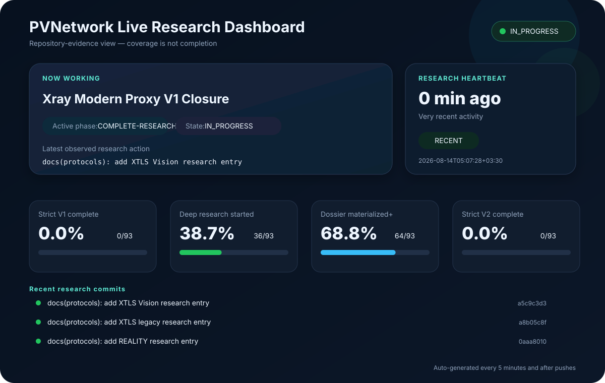

# PVNetwork — Live Project Status

<a href="LIVE_PROGRESS.md">🇮🇷 فارسی</a> &nbsp;•&nbsp; <strong>🇬🇧 English</strong>

> **Note:** research coverage is not strict completion. Only `COMPLETE-*` means all required gates have passed.

## 🔴 What is active right now?

- **Current focus:** `Xray Modern Proxy V1 Closure`
- **Work unit:** `XRAY-MODERN-PROXY-V1-CLOSURE`
- **Phase:** `COMPLETE-RESEARCH-v1`
- **State:** `IN_PROGRESS`

### Latest observed real research action

- [`a5c9c3d3e4`](https://github.com/DashSaman/PVN-amirrezagol/commit/a5c9c3d3e4d519368b3ebf3cbb719098d05c5515) — **docs(protocols): add XTLS Vision research entry**
- Commit time: `2026-08-14T05:07:28+03:30`
- Heartbeat: **Very recent activity** — about **0 min** ago

### Exact next action recorded in state

> Continue Xray original-v1 closure from AGENTS_HANDOFF_2026-08-14_XRAY_V1_1.md: deep-audit libXray API/lifecycle/build/dependencies/issues, create Xray per-entry capability/support-reuse decisions, expand v2rayNG source/storage/VpnService/import evidence, add security/dependency-advisory and commander/API/stats control maps, synchronize Xray INDEX and numbered entries, checkpoint, then continue the next unfinished original v1 family without waiting for owner. Keep WireGuard/AmneziaWG residual v1 work queued before any overall v1 completion claim.

## 📊 Evidence-based progress

| Metric | Count | Percent |
|---|---:|---:|
| Strict V1 complete | 0/93 | **0.0%** |
| Deep research started | 36/93 | **38.7%** |
| Dossier/skeleton or deeper | 64/93 | **68.8%** |
| Strict V2 complete | 0/93 | **0.0%** |

## 🕒 Recent research commits

- `2026-08-14T05:07:28+03:30` — [`a5c9c3d3e4`](https://github.com/DashSaman/PVN-amirrezagol/commit/a5c9c3d3e4d519368b3ebf3cbb719098d05c5515) — docs(protocols): add XTLS Vision research entry
- `2026-08-14T05:07:17+03:30` — [`a8b05c8ff8`](https://github.com/DashSaman/PVN-amirrezagol/commit/a8b05c8ff8618680b290b3e91a6cabaa21ab04db) — docs(protocols): add XTLS legacy research entry
- `2026-08-14T05:07:08+03:30` — [`0aaa801012`](https://github.com/DashSaman/PVN-amirrezagol/commit/0aaa80101215e7a33dbd03f5e5004a754a727b20) — docs(protocols): add REALITY research entry
- `2026-08-14T05:06:50+03:30` — [`77981fa64a`](https://github.com/DashSaman/PVN-amirrezagol/commit/77981fa64af076c841528e5607e9d9d3f98ccf32) — docs(protocols): link Shadowsocks entry to Xray research evidence
- `2026-08-14T05:06:39+03:30` — [`eaaea80cd0`](https://github.com/DashSaman/PVN-amirrezagol/commit/eaaea80cd0e2082f3b4bcf9a74ea01798b882638) — docs(protocols): link Trojan entry to Xray research evidence
- `2026-08-14T05:06:27+03:30` — [`2326c7baa1`](https://github.com/DashSaman/PVN-amirrezagol/commit/2326c7baa1b9b8278949d0da2c7e7b8b178102b9) — docs(protocols): link VMess entry to Xray research evidence
- `2026-08-14T05:06:14+03:30` — [`cb7d8fd30b`](https://github.com/DashSaman/PVN-amirrezagol/commit/cb7d8fd30b4467934065dd6490946c64405d758e) — docs(protocols): link VLESS entry to Xray research evidence
- `2026-08-14T05:05:40+03:30` — [`8c1acb20fa`](https://github.com/DashSaman/PVN-amirrezagol/commit/8c1acb20fa822795c6f0ca27d575a469f7f5c7ba) — docs(research): add Xray security advisory and release safety review

## ✅ How to verify work is really moving

Refresh this page and watch three things: **latest research commit, heartbeat time, and active work unit**. Dashboard-only commits are filtered out so they cannot fake progress.

Sources: [`AGENT_RUN_STATE`](docs/AGENT_RUN_STATE.json) · [`V1 tracker`](research/RESEARCH_COMPLETENESS.md) · [`V2 tracker`](research/REFERENCE_V2_COMPLETENESS.md) · [`Checkpoint log`](docs/AGENT_CHECKPOINT_LOG.md)
